# Дерево отрезков. Оно же ДО.

### Задача
Решим такую задачу. Есть массив $a_0, a_1, \ldots , a_{n-1}$ из $n$ чисел. Нужно уметь обрабатывать за быстро ( $\mathcal{O}(\log n)$ ) 2 типа запросов:

1. Даны $l$ и $r$. Найти $\Sigma_{i=l}^{r} a_i$
2. Даны $i$ и $x$. Сделать $a_i = x$

Если решать задачу без второго запроса, то можно с помощью префиксных сумм отвечать за $\mathcal{O}(1)$ на первый тип запросов. Однако если бы мы захотели обрабатывать еще и обновления в массиве, то нам каждый раз пришлось бы перестраивать массив префикс сумм за $\mathcal{O}(n)$ для обработки второго запроса. Для устранения сей несправедливости применим дерево отрезков.

### Идея

Разбить массив на множество отрезков $T$ (отрезки могут пересекаться и включаться один в другой). Для каждого отрезка хранить значение суммы чисел на нём так, чтобы для ответа нужно было насуммировать значения из $\mathcal{O}(\log n)$ отрезков, а для обновления нужно было изменить значения $\mathcal{O}(\log n)$ отрезков.

В жизни каждого рано или поздно встаёт вопрос $-$ отрезки или полуинтервалы? Зачастую, это выбор каждого в конкретный момент, но в данной статье мы будем работать не с отрезками $[l, r]$, а с полуинтервалами $[l, r)$ (правая граница не включительно). Так принято и в C++ и так действительно очень удобно решать многие задачи.
Так же для удобства будем считать, что $n = 2^k$, для некоторого целого $k$. Если массив имеет неподходящий размер - заполним его нейтральными элементами относительно сложения (нулями) до ближайшей степени двойки.

#### Справка

$y$ $-$ является нейтральным элементом для $f(x)$ если $f(x, y) = f(y, x) = x, \forall x$.

Очевидно, что нам необходимо включить в $T$ все отрезки вида $[i, i+1)$. Отобразим их графически друг за другом. Таким образом, отображённое ниже множество отрезков по сути является самим исходным массивом.

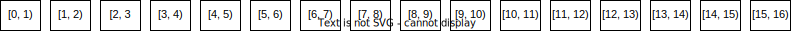

А теперь давайте включим в $T$ все отрезки вида $[i, i+2)$, $i \mod 2 = 0$. Иными словами, сгруппируем элементы по 2 в исходном массиве, получим новый, внесём новый массив в $T$.

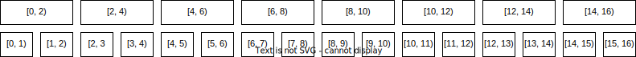

Включим также и отрезки вида $[i, i+4)$, $i \mod 4 = 0$. Или по аналогии продолжая группировку массива по парам соседних элементов, только уже от шага с отрезками $[i, i+2)$.

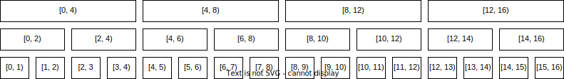

Итоговый алгоритм выбора отрезков включенных в $T$: все отрезки удовлетворяюшие требованию $[i, i+2^k)$, $i \mod 2^k = 0$.

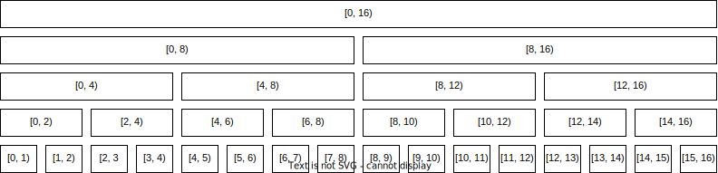

#### Лемма: 
число "уровней" в данной конструкции в точности $k$, если $n = 2^k$, что по сути $\log_2 n$. Отсюда получаем что высота конструкции $\mathcal{O}(\log n)$. Док-во: изначально $n$ элементов на уровне, каждый следующий делит их число на $2$.

Из данной леммы очевидно, что при запросе второго типа нам нужно обновить значение суммы для $\mathcal{O}(\log n)$ отрезков, так как на каждом уровне каждый элемент массива входит ровно в $1$ отрезок (отрезки на одном уровне не пересекаются, а их объединение образует отрезок равный всему массиву).

Пример для запроса обновления в позиции $11$ (синим выделены те отрезки, значение которых надо обновить):

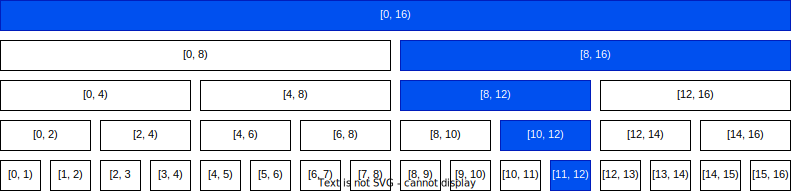

Для запроса первого типа достаточно насуммировать значения из $\mathcal{O}(\log n)$ отрезков. Давайте рекурсивно спускаться по уровням вниз, при этом на текущем уровня стараясь взять как можно больше отрезков, но не беря те части, которые уже были взяты где-то уровнем выше. Тогда получится, что на каждом уровне мы возьмем значение не более двух отрезков. Доказывать это прямо сейчас нет смысла, это будет более понятно после описания процедуры взятия суммы на отрезке.

Пример для запроса $[3, 11)$ (синим - отрезки с которых берём значение суммы, серым - вроде бы интересующие, но включенные в отрезки на более высоком уровне):

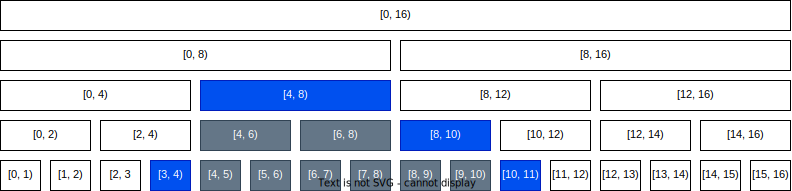

### А при чём тут дерево?

Напомню, что структура данных называется деревом отрезков. Вершинами этого дерева являются отрезки из множества $T$. Рёбра проводятся между элементами соседних уровней, и обозначают включение одного отрезка в другой. Таким образом, получается у всех вершин в точности 2 ребёнка, кроме листовых.

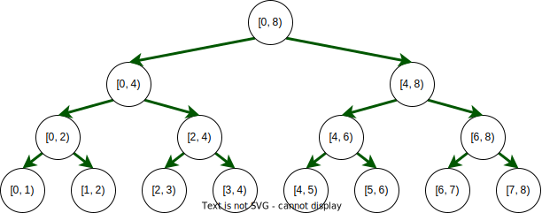

Рассмотрим наконец конкретный пример. Задан массив: $[3, 7, 2, 1, 6, 4, 7]$. Сейчас $n = 7$, для успешного построения ДО добавим в конец ещё нулей до ближайшей степени $2$ (сделаем $n = 8$): $[3, 7, 2, 1, 6, 4, 7, 0]$. В самом массиве эти нули можно не добавлять, но при построении и использовании ДО с ними будет куда проще. Приведём же наконец дерево отрезков на сумму, построенное для данного массива. Для начала заполним значения в листах. Для этого просто перенесём туда значения из массива:

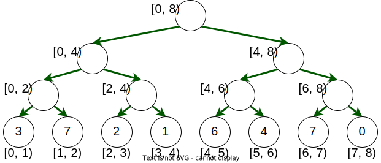

Дальше каждый следующий уровень дерева строится простым суммированием значений в детях:

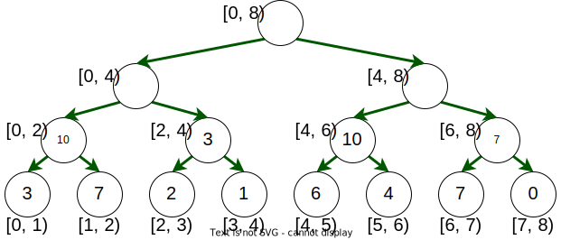

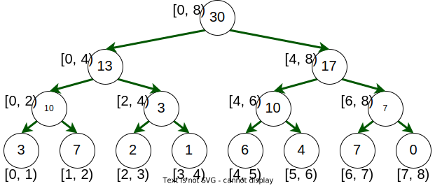

Заметим, что можно строить как рекурсивно сверху вниз (запуститься из корня, сказать что сумма в нём это сумма в левом и правом ребенке, запустить рекурсивное вычисление в его детей, и т.д. до листов, а в них записаны числа из массива для базы рекурсии), так и идя снизу вверх, как и показано на рисунке (на ДО операции можно реализовывать "сверху" и "снизу").

Оценим наконец, число вершин в дереве. Пусть $n = 2^k$, тогда число вершин это $2 \cdot n - 1$. Действительно, мы имеем $n$ вершин на самом нижнем уровне, далее на каждом уровне в $2$ раза меньше вершин, то есть $n + \frac{n}{2} + \frac{n}{4} + \ldots + 4 + 2 + 1 < n \cdot (1 + \frac{1}{2} + \frac{1}{4} + \ldots) = 2 \cdot n$.

### И как это реализовать?

Конечно сделать это можно несколькими способами, но мы рассмотрим классический - будем хранить дерево в массиве. Для этого нам желательно придумать хорошую индексацию вершин, позволяющую быстро и лаконично реализовывать ДО. Для этого достаточно сказать что корень дерева имеет индекс $1$, и для любой вершины с индексом $v$ её левый сын $-$ $2 \cdot v$, а правый сын $-$ $2 \cdot v + 1$:

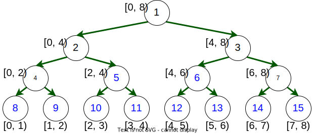

Таким образом нам не нужно хранить граф как это обычно делается например списками смежности, т.к. все рёбра вычислимы простой функцией. Более того, если мы будем всегда спускаться в вершину из корня, нам не нужно хранить границы отрезков, которым соответсвуют вершины, так как если текущая вершина имела границы $[l, r)$, то обозначив середину отрезка за $mid = (l + r) / 2$, левый ребёнок будет иметь границы $[l, mid)$, а правый $-$ $[mid, r)$.

Заметим, что очень удобно использовать битовые операции при работе с ДО. например размера массива можно задать как `SZ = 1 << k`, Тогда размером массива для вершин ДО будет `SZ << 1`, а середина отрезка `mid = (l + r) >> 1`. Левый ребёнок вершины $v$ $-$ `v << 1`, правый - `v << 1 | 1`.

#### Построение ДО

```cpp
// 2^17, хорошее ограничение например для n <= 10^5
const int SZ = 1 << 17; 

int a[SZ]; // исходный массив.
// всё что нам нужно хранить для ДО - значение суммы на отрезке.
int t[SZ << 1]; 

// [l, r) - отрезок соответстующий вершине.
// v - номер вершины
void build(int l = 0, int r = SZ, int v = 1){ 
    if (r - l == 1) { // лист
        t[v] = a[l];
        return;
    }

    int mid = (l + r) >> 1;
    build(l, mid, v << 1);
    build(mid, r, v << 1 | 1);
    t[v] = t[v << 1] + t[v << 1 | 1];
}

void solve(){
    int n;
    cin >> n;
    for (int i = 0; i < n; i++){
        cin >> a[i];
    }

    build();
}
```

Время работы функции `build` $-$ $\mathcal{O}(n)$, т.к. каждую вершину она посетит ровно $1$ раз и сделает в ней $\mathcal{O}(1)$ действий. Также обратим внимание, что ДО потребляет $\mathcal{O}(n)$ памяти, а в худшем случае мы говорим что мы можем почти в $2$ раза увелить массив (добавив нули) и получаем, с учётом того что вершин $2 \cdot n - 1$, не более $4 \cdot n$ размер массива $t$.

#### Обновление в ДО

```cpp
// сделать a[i] = x
void upd(int i, int x, int l = 0, int r = SZ, int v = 1){
    if (i < l || r <= i){ // i не в ходит в [l, r)
        return;
    }

    if (r - l == 1){
        t[v] = x;
        return;
    }

    int mid = (l + r) >> 1;
    upd(i, x, l, mid, v << 1);
    upd(i, x, mid, r, v << 1 | 1);
    t[v] = t[v << 1] + t[v << 1 | 1];
}
```

Внутри `upd` мы имеем ветвление на $2$ рекурсивных вызова, но один из них прервется по условию в начале функции, потому время работы пропорционально высоте дерева (на каждом уровне посетим не более двух вершин, обновим ровно одну), а значит `upd` работает за $\mathcal{O}(\log n)$

#### Взятие суммы на отрезке

```cpp
// найти сумму на [ql, qr)
int get(int ql, int qr, int l = 0, int r = SZ, int v = 1){
    if (qr <= l || r <= ql){ // [l, r) не пересекатся с [ql, qr)
        return 0;
    }

    if (ql <= l && r <= qr){ // [l, r) полностью входит в [ql, qr)
        return t[v];
    }

    int mid = (l + r) >> 1;
    return get(ql, qr, l, mid, v << 1) + get(ql, qr, mid, r, v << 1 | 1);
}
```

Опять имеем ветвление на $2$ рекурсивных вызова. Не более $1$ раза за все время обработки запроса оба рекурсивных вызова не будут прерваны. Значит будут посещены на более $4 \cdot \log n$ вершин и взяты значения сумм из не более чем $2 \cdot \log n$ вершин. Следовательно время работы `get` $-$ $\mathcal{O}(\log n)$.

В момент, когда оба рекурсивных вызова не были прерваны мы получаем, что из левого ребёнка нас интересует какой-то суффикс, а из правого какой-то префикс:

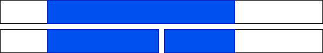

Теперь остаются только 2 вызова типа найти сумму на префиксе (суффиксе). И хотя бы один рекурсивный вызов из префикса (суффикса) будет точно прерываться.

В данном случае прервётся вызов правого ребёнка (нет пересечения):


Здесь прервётся вызов левого ребёнка (Полностью лежит внутри отрезка):


### Дерево отрезков - самая мощная структура данных в мире!

До текущего момента ДО рассматривалось только как обработчик двух типов событий (обновить элемент и взять сумму на отрезке). Но оно умеет гораздо больше!

Например, можно вместо суммы на отрезке (RSQ $-$ range sum query), брать минимум (максимум) (RMQ $-$ range minimum query). При этом реализация практически никаки не меняется, мы просто вместо суммы будем брать минимум, а вместо 0 нейтральным элементом будет $\infty$ (в первую очередь это важно внутри функции `get` для условия непересечения отрезков). 

Аналогичным образом ДО используется и для взятия GCD, произведения, числа минимумов, взятия lower_bound на отрезке массива и множества других вещей. Грубо говоря, вы можете реализовать ДО для любых ассоциативных операций. Для детального ознакомления необходимо ознакомится со статьей на emaxx, начиная со слов "Усложнённые версии дерева отрезков" и заканчивая перед "Обновление на отрезке": https://e-maxx.ru/algo/segment_tree. Стоит отметить, что реализации ДО там отличаются от приведённых здесь, в связи с чем будьте начеку!

### Обновление на отрезке

На текущий момент, если вдруг нас попросят, например, прибавить ко всем элементам на отрезке одинаковое число, это может вызвать некоторые трудности со временем обработки запроса. Тривиальным образом мы умеем делать это за $\mathcal{O}((r - l) \cdot \log n)$, просто вызывая по одному обновление конкретного элемента. Но для начала, давайте ускорим время работы до $\mathcal{O}((r - l) + \log n)$. Не будем вызывать $r - l$ отдельных обновлений а напишем новую функцию, которая заходит во все интересующие нас вершины ДО и обновляет в них значения:

```cpp
// на [ql, qr) прибавить ко всем числам d
void upd(int ql, int qr, int d, int l = 0, int r = SZ, int v = 1){
    if (qr <= l || r <= ql){
        return;
    }

    if (r - l == 1){
        t[v] += d;
        return;
    }

    int mid = (l + r) >> 1;
    upd(ql, qr, d, l, mid, v << 1);
    upd(ql, qr, d, mid, r, v << 1 | 1);
    t[v] = t[v << 1] + t[v << 1 | 1];
}
```

По сути данная функция заходит во все интересующие нас отрезки, и прибавляет d * (r - l) на каждом из них. Но многие из обновлённых отрезков образуют в своём объединении какой-то другой отрезок, уровнем выше.

Пример для $ql = 3$, $qr = 11$. Серым и синим $-$ обновленные отрезки, но серым те, что в своем объединении дают отрезок уровнем выше:


### Идея

Не будем обновлять серые отрезки сразу, а обновим их только при необходимости. Действительно, Если всегда идти по дереву сверху вниз, то мы в начале пройдем синий отрезок, и только потом попадём в серый, а значит можно запоминать информацию о том, что текущий отрезок был синим, а его потомки - серые. Поэтому корректность всех операций при грамотной реализации будет сохраняться, а синие отрезки посещаются тем же алгоритмом что и обычный `get` на отрезке, т.е. можно достичь времени работы $\mathcal{O}(\log n)$.

### Рассмотрим реализацию следующих запросов: 

1. сумма на $[l, r)$.
2. прибавить $d$ ко всем числам на $[l, r)$.

Теперь, для вершины нам нужно знать не только сумму на ней, но и число прибавленное на отрезке, и еще не прибалвенное детям (поддерживая серо-синюю логику). Это значение мы будем лениво проталкивать вниз, как только необходимо зайти в потомка.

```cpp
int t[SZ << 1]; 
int p[SZ << 1]; // push - значение, которое нужно протолкнуть
```

```cpp
// перед тем как зайти в любого ребёнка v, нужно вызвать эту функцию
// len - длина отрезка, соответствующего вершине v.
void push(int v, int len){
    // помечаем детей синим цветом
    p[v << 1] += p[v];
    p[v << 1 | 1] += p[v];

    // изменяем сумму в детях
    t[v << 1] += p[v] * len >> 1;
    t[v << 1 | 1] += p[v] * len >> 1;
    
    // перестаём быть синей вершиной
    p[v] = 0;
}
```

```cpp
// на [ql, qr) прибавить ко всем числам d
void upd(int ql, int qr, int d, int l = 0, int r = SZ, int v = 1){
    if (qr <= l || r <= ql){
        return;
    }

    if (ql <= l && r <= qr){
        t[v] += d * (r - l);
        p[v] += d;
        return;
    }

    // push нужно вызывать тогда, когда мы хотим пойти в ребёнка.
    // существуют другие реализации изменения на отрезке, 
    // некоторые требуют вызова push не только при входе в ребёнка
    push(v, r - l);

    int mid = (l + r) >> 1;
    upd(ql, qr, d, l, mid, v << 1);
    upd(ql, qr, d, mid, r, v << 1 | 1);
    t[v] = t[v << 1] + t[v << 1 | 1];
}
```

Функция get нуждается только в добавлении в неё `push`.

Если изменить первый запрос на минимум на отрезке, то достаточно будет избваиться от умножения $d$ на длину отрезка (т.к. теперь прибавив число ко всем элементам на отрезке, мы изменили и минимум на это же самое число).

### Прибавить арифметическую прогрессию на отрезке

Имеем следующие запросы:

1. Сумма на $[l, r)$
2. Даны $b$ и $d$. Нужно сделать `a[l] += b, a[l+1] += b + d, a_[l+2] += b + 2*d, ... , a[r - 1] += b + (r-l-1)*d`

Вместо массива $p$ будем хранить 2 массива - $b$ и $d$, хранящих ещё не протолкнутую прогрессию для отрезка. Изменение значения суммы на самом синем отрезке будем делать с помощью формулы суммы арифметической прогрессии. Вообще говоря, можно так-же заметить что массив $b$ будет выполнять те-же функции что и массив $p$ раньше.

```cpp
void push(int v, int len){
    len >>= 1; // для удобства будем брать длину ребёнка
    b[v << 1] += b[v];
    b[v << 1 | 1] += b[v] + d[v] * len; // b у правого изменяется
    d[v << 1] += d[v];
    d[v << 1 | 1] += d[v];

    // изменяем сумму в детях
    t[v << 1] += (2 * b[v] + d[v] * (len - 1)) * len >> 1;
    t[v << 1 | 1] += (2 * (b[v] + d[v] * len) + d[v] * (len - 1)) * len >> 1;
    
    b[v] = 0;
    d[v] = 0;
}
```

Приводить функцию `upd` смысла нет, действовать нужно лишь аналогично тому как в `push`.

Опять отсылаю на статью с emaxx https://e-maxx.ru/algo/segment_tree, на сей раз уже в раздел "Обновление на отрезке" и заканчивая перед "Обобщение на большие размерности".

### ДО снизу

Сейчас все реализованные функции являются рекурсивными, идущими сверху. Но все их можно сделать нерекурсивными. Некоторые делаются легко и просто, некоторые более сложным образом. Здесь я предложу лишь реализации `build` и `upd`.


Если идти по номерам вершин в порядке их увеличения, то это будет топологической сортировкой ДО. Значит, идя в порядке уменьшения номеров вершин, мы можем насчитывать значения вершин динамическим программированием.

```cpp
for (int i = 0; i < n; i++){
    // лего убедиться, что i | SZ - номер листа для i-го элемента
    t[i | SZ] = a[i];
}
for (int v = SZ - 1; v; v--){
    t[v] = t[v << 1] + t[v << 1 | 1];
}
```

Как было сказано ранее, при обновлении на каждом уровне нас интересует ровно один отрезок. И т.к. ребёнок $v$ это либо $2 \cdot v$ либо $2 \cdot v + 1$, то родитель $v$ это $\frac{v}{2}$:

```cpp
void upd(int i, int x){
    i |= SZ;
    t[i] = x;
    while (i > 1){
        i >>= 1;
        t[i] = t[i << 1] + t[i << 1 | 1];
    }
}
```
