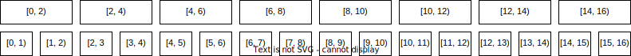

# Дерево отрезков. Оно же ДО.

### Задача
Решим такую задачу. Есть массив $a_0, a_1, \ldots , a_{n-1}$ из $n$ чисел. Нужно уметь обрабатывать за быстро ( $\mathcal{O}(\log n)$ ) 2 типа запросов:

1. Даны $l$ и $r$. Найти $\Sigma_{i=l}^{r} a_i$
2. Даны $i$ и $x$. Сделать $a_i = x$

Если решать задачу без второго запроса, то можно с помощью прексных сумм отвечать за $\mathcal{O}(1)$ на первый тип запросов. Однако если бы мы захотели обрабатывать еще и обновления в массиве, то нам каждый раз пришлось бы перестраивать его за $\mathcal{O}(n)$ для обработки второго запроса. Для устранения сей несправедливости применим дерево отрезков.

### Идея

Разбить массив на множество отрезков $T$ (отрезки могут пересекаться и включать один в другой). Для каждого отрезка хранить значение суммы чисел на нём так, чтобы для ответа нужно было насуммировать значения из $\mathcal{O}(\log n)$ отрезков, а для обновления нужно было изменить значения $\mathcal{O}(\log n)$ отрезков.

Будучи умными и адекватнемы людьми, будем работать в дальнейшем не с отрезками $[l, r]$, а с полуинтервалами $[l, r)$ (правая граница не включительно). Так принято и в C++ и так действительно очень удобно решать многие задачи.
Так же для удобства будем считать что $n = 2^k$, для некоторого целого $k$.

Очевидно, что нам необходимо включить в $T$ все отрезки вида $[i, i+1)$. Отобразим их графически друг за другом. Таким образом, отображённое ниже множество отрезков по сути является самим исходным массивом.

А теперь давайте включим в $T$ все отрезки вида $[i, i+2)$, $i \mod 2 = 0$. Иными словами, сгруппируем элементы по 2 в исходном массиве, получим новый, внесём новый массив в $T$.

Включим также и отрезки вида $[i, i+4)$, $i \mod 4 = 0$. Или по аналогии продолжая группировку массива по парам соседних элементов, только уже от шага с отрезками $[i, i+2)$.

Итоговый алгоритм выбора отрезков включенных в $T$: все отрезки удовлетворяюшие требованию $[i, i+2^k)$, $i \mod 2^k = 0$.

Лемма: число "уровней" в данной конструкции в точности $k$, если $n = 2^k$, что по сути $\log_2 n$. Отсюда получаем что высота конструкции $\mathcal{O}(\log n)$. Док-во: изначально $n$ элементов на уровне, каждый следующий делит их число на $2$.

Из данной леммы очевидно, что при запросе второго типа нам нужно обновить значение суммы для $\mathcal{O}(\log n)$ отрезков, так как на каждом уровне каждый элемент массива входит ровно в $1$ отрезок (отрезки на одном уровне не пересекаются, а их объединение образует отрезок равный всему массиву).

Lля запроса первого типа достаточно насуммировать значения из $\mathcal{O}(\log n)$ отрезков. Давайте рекурсивно спускаться по уровням вниз, при этом на текущем уровня стараясь взять как можно больше отрезков, но не беря те части, которые уже были взяты выше. Тогда получится, что на каждом уровне мы возьмем значение не более двух отрезков. Доказывать это прямо сейчас нет смысла, это будет лучше понятно после описания процедуры взятия суммы на отрезке.

Пример для запроса $[3, 11)$ (синим - отрезки с которых берём значение суммы, серым - вроде бы интересующие, но включенные в отрезки на более высоком уровне):

