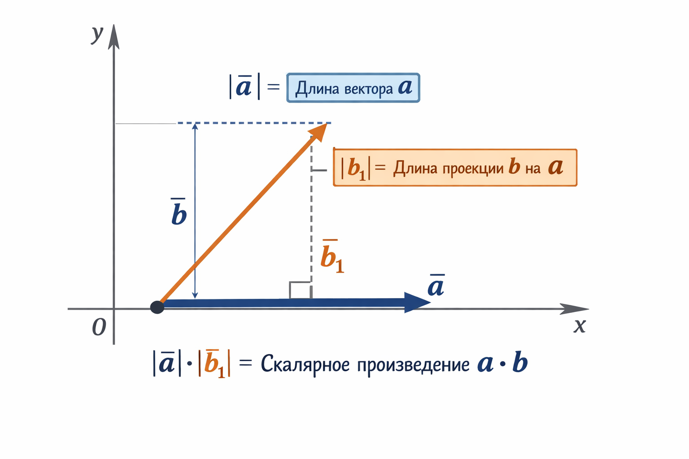
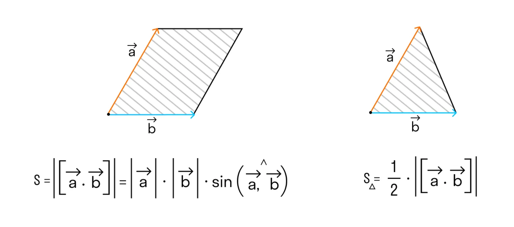
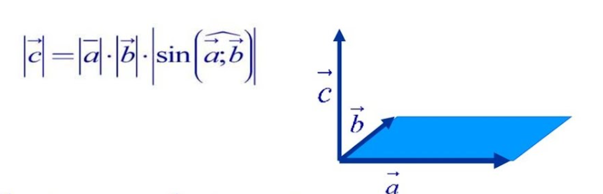

# Геометрия. Введение

## 0. Базовые принципы (Вещественные числа)

Главная проблема геометрии — **точность**.
*   Вещественные числа имеют особый формат хранения в компьютере. Они хранятся в виде мантиссы и экспоненты, в связи с чем возникают проблемы с точностью хранимых чисел и накапливаемой в ходе сложных вычислений погрешности.
*   **Правило:** Если задачу можно решить в целых числах (координаты целые, операции только $+,-,*$), решайте в целых (тип `long long`). Иногда задачу можно решать в рациональных числах, храня число как числитель и знаминатель, и сокрашая на НОД обе части дроби после каждого вычисления, но такое вряд-ли пригодится на школьных олимпиадах.
*   Если нужны вещественные числа, используйте `double` или `long double` (точнее чем `double`, но дольше работает). Не используйте `float`, он слишком мал и имеет очень низкую точность.
*   Сравнение чисел никогда не делается через `==`. Используем $\varepsilon$ (EPS).

```cpp
const double EPS = 1e-9;
// сравнить 2 числа на равенство (a - b == 0, 
// но с учётом погрешности)
bool equal(double a, double b) {
    return abs(a - b) < EPS;
}

// a < b это эквивалентно b - a > 0, 
// но учитываем погрешность (устраняем равенство)
bool less(double a, double b) {
    return b - a > eps;
}
```                                          

---

## 1. Точка и Вектор

Вектор $-$ это длина и направление (направленный отрезок). Векторы считаются равными если равны их длина и направление равны, а потому мы будем оперировать радиус-вектором (то есть вектором, начало которого находится в начале координат). Поэтому в программировании Точка и Вектор описываются одной и той же структурой, но имеют разный физический смысл.

*   **Точка (Point):** Место в пространстве $(x, y)$.
*   **Вектор (Vector):** Направление и длина. Вектор $\vec{AB} = B - A$. Координаты вектора — это смещение $(x_B - x_A, y_B - y_A)$.

### Основные операции
1.  **Сложение:** Точка + Вектор = Точка. Вектор + Вектор = Вектор.
2.  **Вычитание:** Точка - Точка = Вектор.
3.  **Умножение на число:** Вектор * $k$ = Масштабированный вектор.
4.  **Длина вектора:** $|\vec{a}| = \sqrt{x^2 + y^2}$ (по теореме Пифагора).

### Свойства операций

#### 1. Сложение векторов

##### 🔹 Коммутативность

$$\vec{a} + \vec{b} = \vec{b} + \vec{a}.$$

##### 🔹 Ассоциативность

$$(\vec{a} + \vec{b}) + \vec{c} = \vec{a} + (\vec{b} + \vec{c}).$$

##### 🔹 Существование нулевого вектора

Существует ( $\vec{0}$ ), такой что

$$\vec{a} + \vec{0} = \vec{a}.$$

##### 🔹 Существование противоположного вектора

Для любого ( $\vec{a}$ ) существует ( $-\vec{a}$ ), такой что
$$\vec{a} + (-\vec{a}) = \vec{0}.$$

#### 2. Умножение вектора на число

##### 🔹 Дистрибутивность относительно сложения векторов

$$\lambda(\vec{a} + \vec{b}) = \lambda\vec{a} + \lambda\vec{b}$$

##### 🔹 Дистрибутивность относительно сложения чисел

$$(\lambda + \mu)\vec{a} = \lambda\vec{a} + \mu\vec{a}$$

##### 🔹 Ассоциативность умножения на скаляр

$$\lambda(\mu\vec{a}) = (\lambda\mu)\vec{a}$$

##### 🔹 Умножение на единицу

$$1 \cdot \vec{a} = \vec{a}$$

##### 🔹 Умножение на минус единицу (смена направления вектора)

$$(-1) \cdot \vec{a} = -\vec{a}$$ 

---

## 2. Произведения векторов

Это **фундамент** всей олимпиадной геометрии. Забудьте про уравнения прямых $y = kx + b$, используйте произведения векторов.

### А. Скалярное произведение (Dot Product)
Обозначается: $(\vec{a}, \vec{b})$ или $\vec{a} \cdot \vec{b}$.

#### Что такое скалярное произведение (геометрически)

Пусть $\vec{a}$ и $\vec{b}$ — векторы на плоскости, а $\varphi$ — угол между ними (берём $0\le \varphi \le \pi$).

**Определение:**
$$\vec{a}\cdot \vec{b} = |\vec{a}| \cdot |\vec{b}| \cdot \cos\varphi$$

##### Смысл

* Если $\varphi$ острый ($<90^\circ$), то $\cos\varphi>0$ ⇒ $\vec{a}\cdot\vec{b}>0$.
* Если $\varphi=90^\circ$, то $\cos\varphi=0$ ⇒ $\vec{a}\cdot\vec{b}=0$.
* Если $\varphi$ тупой ($>90^\circ$), то $\cos\varphi<0$ ⇒ $\vec{a}\cdot\vec{b}<0$.



#### Свойства

##### 🔹 Коммутативность

$$(\vec{a}, \vec{b}) = (\vec{b}, \vec{a})$$

##### 🔹 Билинейность

$$(\vec{a}+\vec{b}, \vec{c}) = (\vec{a}, \vec{c}) + (\vec{b}, \vec{c})$$

$$(\lambda \vec{a}, \vec{b}) = \lambda (\vec{a}, \vec{b})$$

#### Координатная формула на плоскости

Пусть
$$\vec{a}=(a_x,a_y),\qquad \vec{b}=(b_x,b_y)$$

Для удобства введём вектора $\vec{i}=(1,0)$ и $\vec{j}=(0,1)$ — стандартный базис. Тогда
$$\vec{a}=a_x\vec{i}+a_y\vec{j},\qquad \vec{b}=b_x\vec{i}+b_y\vec{j}$$

Теперь проведём ряд преобразований:

$$(\vec{a}, \vec{b}) = (a_x\vec{i}+a_y\vec{j}, b_x\vec{i}+b_y\vec{j}) = $$

По билинейности:

$$ = a_x b_x (\vec{i}, \vec{i}) + a_x b_y (\vec{i},\vec{j}) + a_y b_x (\vec{j},\vec{i}) + a_y b_y (\vec{j},\vec{j}) = $$

$(\vec{i}, \vec{j}) = 0$ (векторы перпендикулярны) и $(\vec{i}, \vec{i}) = 1$, значит

$$ = a_x b_x \cdot 1 + a_x b_y \cdot 0 + a_y b_x \cdot 0 + a_y b_y \cdot 1 = a_xb_x+a_yb_y$$

Получили простую формулу без триганометрии:
$$\vec{a}\cdot\vec{b}=a_xb_x+a_yb_y.$$


### Б. Векторное (косое) произведение (Cross Product)
Обозначается: $[\vec{a}, \vec{b}]$ или $\vec{a} \times \vec{b}$.

#### Что такое векторное произведение (геометрически)

Пусть $\vec{a}$ и $\vec{b}$ — векторы на плоскости, а $\varphi$ — угол между ними (берём $0\le \varphi \le \pi$).

**Определение:**
$$\vec{a}\times \vec{b} = |\vec{a}| \cdot |\vec{b}| \cdot \sin\varphi$$

По сути это площадь параллелограмма, натянутого на векторы $\vec{a}$ и $\vec{b}$.



Мы на самом деле в рамках данного материала будем рассматривать не совсем векторное произведение, так как на плоскости оно строго определено быть не может, но псведовекторное произведение (с точки зрения площади параллелограмма) мы вполне можем использовать. Дело в том, что *векторное* произведение так называется потому, что его результат это не число (скаляр, потому *скалярное* произведение так и называют), а вектор, который перпендикулярен $\vec{a}$ и $\vec{b}$ одновременно, и как раз тот скаляр что мы вычисляем по предложенной выше формуле является длиной этого вектора. Пример векторного произведения в 3D пространстве:



#### Знак векторного произведения

Площадь параллелограмма всегда неотрицательна, но векторное произведение может быть положительным, отрицательным или нулём. Это зависит от ориентации (поворота) от $\vec{a}$ к $\vec{b}$. 

$$
[\vec a,\vec b] > 0 \quad \Longleftrightarrow \quad
поворот \; от \; \vec a \; к \; \vec b \; против \; часовой \; стрелки. $$

$$
[\vec a,\vec b] < 0
\quad \Longleftrightarrow \quad
поворот \; по \; часовой \; стрелке.
$$

$$
[\vec a,\vec b] = 0
\quad \Longleftrightarrow \quad
векторы \; коллинеарны.
$$

Важно помнить, что нужно брать модуль от векторного произведения, так как это *ориентированная* площадь параллелограмма. 

На практике зачастую налево или направо отрицательный знак определяется методом тыка (всего 2 варианта).

#### Свойства

##### 🔹 Антикоммутативность

$$[\vec{a}, \vec{b}] = -[\vec{b}, \vec{a}]$$

##### 🔹 Дистрибутивность

$$ [\vec{a}, (\vec{b}+\vec{c})] = [\vec{a}, \vec{b}] + [\vec{a}, \vec{c}]$$


#### Координатная формула на плоскости

Пусть
$$\vec{a}=(a_x,a_y),\qquad \vec{b}=(b_x,b_y)$$

Для удобства введём вектора $\vec{i}=(1,0)$ и $\vec{j}=(0,1)$ — стандартный базис. Тогда
$$\vec{a}=a_x\vec{i}+a_y\vec{j},\qquad \vec{b}=b_x\vec{i}+b_y\vec{j}$$

Теперь проведём ряд преобразований:

$$[\vec{a}, \vec{b}] = [a_x\vec{i}+a_y\vec{j}, b_x\vec{i}+b_y\vec{j}] = $$

По дистрибутивности:

$$ = a_x b_x [\vec{i}, \vec{i}] + a_x b_y [\vec{i},\vec{j}] + a_y b_x [\vec{j},\vec{i}] + a_y b_y [\vec{j},\vec{j}] = $$

$(\vec{i}, \vec{j}) = 0$ (векторы перпендикулярны) и $(\vec{i}, \vec{i}) = 1$, значит

$$ = a_x b_x \cdot 0 + a_x b_y \cdot 1 + a_y b_x \cdot (-1) + a_y b_y \cdot 0 = a_xb_y-a_yb_x$$

Получили простую формулу без триганометрии:
$$\vec{a}\times\vec{b}=a_xb_y-a_yb_x.$$

---

## 3. Прямые, Отрезки, Лучи

### Прямая (Line)
Задается уравнением $Ax + By + C = 0$. Это лучше чем задавать через $y = Ax + B$, так как вертикальные прямые в таком случае не задать.

Через две различные точки всегда проходит ровно одна прямая. По двум точка можно вывести коэффициенты $A$, $B$ и $C$ для уравнения прямой. Сделаем это через векторное произведение. Пусть прямая проходит через точки $P$ и $Q$. Рассмотрим произвольную точку с координатам $(x, y)$. Эта точка лежит на прямой $\qquPd [P - Q, (x, y) - Q] = 0$. 

$$[P - Q, (x, y) - Q] = [P, (x, y)] - [P, Q] - [Q, (x, y)] + [Q, Q] = $$ 
$$ = (P.x \cdot y - P.y \cdot x) - (P.x \cdot Q.y - P.y \cdot Q.x) - (Q.x \cdot y - Q.y \cdot x) + 0 = $$
$$ = (P.x - Q.x) \cdot y + (Q.y - P.y) \cdot x - (P.x \cdot Q.y - P.y \cdot Q.x)$$

Проведём замену $A = Q.y - P.y$, $B = P.x - Q.x$, $C = P.x \cdot Q.y - P.y \cdot Q.x$.

Отсюда получаем что

 Тогда вектор $\vec{PQ}$ перпендикуляр к прямой, значит его координаты пропорциональны $(A, B)$.

Если даны две точки $P$ и $Q$, коэффициенты вычисляются так:
*   $A = P.y - Q.y$
*   $B = Q.x - P.x$
*   $C = -A \cdot P.x - B \cdot P.y$

*Расстояние от точки $(x_0, y_0)$ до прямой:*
$$Dist = \frac{|Ax_0 + By_0 + C|}{\sqrt{A^2 + B^2}}$$

### Отрезок (Segment)
Задается двумя точками.
**Проверка: лежит ли точка $C$ на отрезке $AB$?**
1.  Она должна лежать на прямой $AB$ $\to$ `cross_product(AB, AC) == 0`.
2.  Она должна лежать "между" $A$ и $B$ $\to$ `dot_product(AC, BC) <= 0` (векторы $AC$ и $BC$ направлены в разные стороны или один из них нулевой).

**Пересечение отрезков $AB$ и $CD$:**
Отрезки пересекаются, если концы одного отрезка лежат по разные стороны от прямой, содержащей другой отрезок (проверяется через знаки косых произведений). + Граничные случаи (наложение на одной прямой).

### Луч (Ray)
Задается точкой начала и направляющим вектором.

---

## 4. Хранение в C++ (Шаблон)

Профессиональная реализация структуры `Point` с перегрузкой операторов.

```cpp
#include <iostream>
#include <cmath>

using namespace std;

// Используем long long, если координаты до 10^9 и не нужны деления/корни.
// Иначе double / long double.
typedef long long ftype; 

struct Point {
    ftype x, y;

    // Конструктор
    Point(ftype _x = 0, ftype _y = 0) : x(_x), y(_y) {}

    // Сложение и вычитание векторов
    Point operator+(const Point& other) const {
        return Point(x + other.x, y + other.y);
    }
    Point operator-(const Point& other) const {
        return Point(x - other.x, y - other.y);
    }
    
    // Умножение на скаляр
    Point operator*(ftype k) const {
        return Point(x * k, y * k);
    }

    // Скалярное произведение (Dot Product)
    ftype operator*(const Point& other) const {
        return x * other.x + y * other.y;
    }

    // Векторное/Косое произведение (Cross Product)
    // В C++ приоритет % такой же как *, но для удобства часто используют функцию
    ftype cross(const Point& other) const {
        return x * other.y - y * other.x;
    }
    
    // Длина (вещественная)
    double len() const {
        return sqrt(x*x + y*y);
    }

    // квадрат длины (того же типа, что и координаты)
    // взятие корня дорогая по времени операция и неточная
    // потому если можем - используем квадрат длины
    ftype len2() const {
        return x*x + y*y;
    }
};

// Функция для удобства вызова косого произведения (a ^ b)
// Но будьте осторожны с приоритетом операций ^ в C++ (он ниже чем +)
ftype cross_product(Point a, Point b) {
    return a.x * b.y - a.y * b.x;
}

// Ориентированная площадь треугольника ABC
ftype triangle_area_2x(Point a, Point b, Point c) {
    return (b - a).cross(c - a);
}
```

### Важные заметки по реализации:

1.  **Полярный угол:** Часто нужно сортировать точки по углу вокруг какой-то точки. Используйте функцию `atan2(y, x)`, она возвращает угол в радианах от $(-\pi, \pi]$.
2.  **Чтение:**
    ```cpp
    istream& operator>>(istream& in, Point& p) {
        return in >> p.x >> p.y;
    }
    ```
3.  **Приоритет операций:** В выражении `a ^ b + c`, сначала выполнится `+`, потом `^` (xor). Поэтому лучше писать методы `.cross()` или функции `cross(a, b)`, чтобы избежать ошибок.

---

## 5. Пересечение окружности и прямой, двух окружностей

Можно почитать здесь http://e-maxx.ru/algo/circles_intersection

---

## Шпаргалка: Как решать задачи

1.  **Площадь многоугольника:** Формула шнуровки (Shoelace formula). Сумма косых произведений соседних вершин делить на 2.
    $$S = \frac{1}{2} | \sum_{i=0}^{n-1} (P_i \times P_{i+1}) |$$ (где $P_n = P_0$).
2.  **Слева или справа?** Знак `(B - A).cross(C - A)`.
3.  **Угол?** Используй `dot` для $\cos$ и `cross` для $\sin$. Или `atan2`.
4.  **Сортировка по углу:** Если можно, избегай `atan2` (медленно и double). Используй векторное произведение для сравнения (с проверкой полуплоскостей).