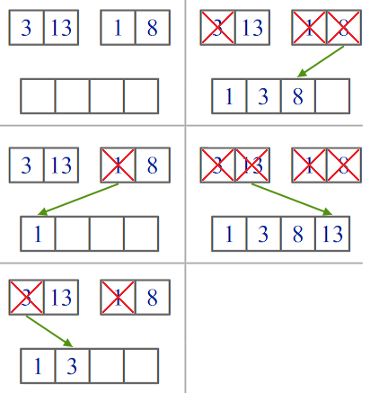

# Сортировки

В рассматриваемых подходах будет рассматриваиться массив $a$ из $n$ чисел. 

## Сортировка пузырьком

Пройдёмся по массиву слева направо, меняя два соседних элемента, если первый больше второго. После такого прохода, максимальный элемент «всплывает» как пузырёк к концу массива $-$ отсюда и название. 

Если повторить эту операцию второй раз, то последние $2$ элемента массива гарантированно будут стоять на своих местах (пузырьком пройдёт второй максимум). В итоге если повторить алгоритм $n - 1$ раз, все элементы встанут на свои места.


Пример реализации:

```cpp
    for (int k = 0; k < n; k++)
        for (int i = 1; i < n; i++)
            // сравниваем элемент с предыдущим
            if (a[i - 1] > a[i])
                // меняем местами, если предыдущий больше
                swap(a[i - 1], a[i]);
```

## Сортировка слиянием

Алгоритм использует принцип «разделяй и властвуй»: задача разбивается на подзадачи меньшего размера, которые решаются по отдельности, после чего их решения комбинируются для получения решения исходной задачи. Конкретно процедуру сортировки слиянием можно описать следующим образом:

1. Если в рассматриваемом массиве один элемент, то он уже отсортирован — алгоритм завершает работу.
2. Иначе массив разбивается на две части, которые сортируются рекурсивно.
3. После сортировки двух частей массива к ним применяется процедура слияния, которая по двум отсортированным частям получает исходный отсортированный массив.

Итак, остановимся подробнее на шаге номер $3$.

### Слияние двух отсортированных массивов

Задача: заданы $2$ отсортированных массива $a$ длины $n$ и $b$ длины $m$. Получить отсортированный массив $c$ длины $n + m$ из элементов массивов $a$ и $b$ за $\mathcal{O}(n + m)$ времени работы.

Пусть $c$ изначально пуст. Будем поддерживать позиции наименьших не добавленных в $c$ элементы массивов $a$ и $b$. Тогда мы сравниваем элементы на этих позициях, и меньший из них записываем в $c$. И затем, в массиве у которого оказался меньший элемент, переходим к следующему элементу и сравниваем теперь его. В конце, если один из массивов закончился, мы просто дописываем в $c$ другой массив.



Пример реализации:

```cpp
vector<int> merge(vector<int> a, vector<int> b) {
    vector<int> c;
    int n = a.size();
    int m = b.size();
    int ia = 0; // индекс меньшего не добавленного в a
    int ib = 0; // индекс меньшего не добавленного в b
    while (ia < n || ib < m) {
        // если из b добавили все, или в a недобавленный меньше чем в b
        if (ib == m || (ia < n && a[ia] < b[ib])) {
            c.push_back(a[ia++]);
        } else {
            c.push_back(b[ib++]);
        }
    }
    return c;
}
```

Каждая итерация цикла `while` увеличивает один из индексов, а значит всего итераций будет ровно $n + m$.

### Итоговая сортировка слиянием

Итак, оценим время работы сортировки слиянием.


Поскольку на каждой итерации рекурсии мы уменьшаем размер массива в $2$ раза, то всего рекурсия будет иметь глубину $\lceil \log_2 n \rceil$ (где $\lceil x \rceil$ — округление числа $x$ до целого вверх). Каждый вызов рекурсии работает за $\mathcal{O}(len)$, где $len$ размер сортируемого массива. На каждом уровне рекурсии каждый элемент встречается не более одного раза, а значит сумма длин всех массивов на каждом уровне рекурсии $\mathcal{O}(n)$, аналогично оценивается и время работы рекурсии на одной глубине. Следовательно, итоговое время работы сортировки слияеним — $\mathcal{O}(n \log n)$.

Пример реализации:

```cpp
vector<int> merge_sort(vector<int> a) {
    int n = a.size();
    if (n <= 1) return a; // база рекурсии

    int m = n >> 1; // середина массива
    // через итераторы можно инициализировать новый вектор
    vector<int> left = merge_sort(vector<int>(a.begin(), a.begin() + m));
    vector<int> right = merge_sort(vector<int>(a.begin() + m, a.end()));
    return merge(left, right);
}
```

## Объекты сортировки

В сортировке пузырьком, слиянием и многих других, не описанных здесь, пользуется только одним: возможностью сравнивавать между собой два элемента массива. А потому например можно сортировать не только числа, но и строки, пары, другие массивы — почти все что угодно. Главное определить операцию сравнения ($<$).

Примеры сравнений:

Строки

* Лексикографически ($“abc” < “b”$)
* По длине строки ($“abc” > “b”$)

Пары чисел

* Лексикографически (${1, 5} < {3, 2}$)
* По сумме чисел (${1, 5} > {3, 2}$)

Числа

* Как обычно ($−3 < 2$)
* По функции, например $x^2$ ($-3 > 2$)

### Встроенная сортировка C++

Сортировка массивов:

```cpp
    int a[n];
    sort(a, a + n);
```

Сортировка векторов:

```cpp
    vector<int> a(n);
    sort(a.begin(), a.end());
```

Время работы $\mathcal{O}(n \log n)$. 

`sort` использует оператор `<`, и если он определён для сортируемого типа данных, то код будет успешно скомпилирован и отработан. Так например, определён оператор `<` для `string`, `pair`, `vector`.

### Компаратор

Сортировка по умолчанию для `string` $-$ лексикографическая

```cpp
    vector<string> a = {"b", "abcde", "def"};
    sort(a.begin(), a.end());
    // a = {"abcde", "b", "def"};
```

Отсортируем по длине строки

```cpp
    sort(a.begin(), a.end(), [&](const string& s1, const string& s2) {
        return s1.size() < s2.size();
    });
    // a = {"b", "def", "abcde"};
```

Вместо лямбда-функции можно передать имя любой функции. Например:

```cpp
    bool cmp(const string& s1, const string& s2) {
        return s1.size() < s2.size();
    }

    ...

    sort(a.begin(), a.end(), cmp);
    // a = {"b", "def", "abcde"};
```

Компаратор можно опредеять для любых типов данных (включая свои классы/структуры), в том числе и для чисел.

```cpp
    vector<int> a = {-3, 0, 2};
    sort(a.begin(), a.end(), [&](int a, int b) {
        return a*a < b*b;
    });
    // a = {0, 2, -3};
```

## Сортировка подсчётом

Все сортировки описанные выше, работают используя попарное сравнение элементов массива. Было доказано, что невозможно придумать сортировку, работающую на сравнении двух объектов, быстрее чем за $\mathcal{O}(n \log n)$. 

Однако, сортировку не обязательно производить используя попарное сравнение элементов. Так например, в особом случае, когда элементы могут принадлежать только какому-то небольшому множеству, можно использовать другой алгоритм — сортировку подсчетом.

Пусть, например, нам гарантируется, что все числа натуральные и лежат в промежутке от 
$1$ до $100$. Тогда есть такой простой алгоритм:

* Создадим массив размера $100$, в котором будем хранить на $k$-ом месте, сколько раз число $k$ встретилось в этом массиве.

* Пройдемся по всем числам исходного массива и увеличим соответствующее значение массива на $1$.

* После того, как мы посчитали, сколько раз каждое число встретилось, можно просто пройтись по этому массиву и вывести $1$ столько раз, сколько встретилась $1$, вывести $2$ столько раз, сколько встретилась $2$, и так далее.

Время работы такого алгоритма составляет $\mathcal{O}(n + m)$, где $m$ $-$ число возможных значений в массиве (в примере выше это $100$). Если количество возможных различных элементов в множестве относительно невелико, то сортировка подсчетом является одним из самых оптимальных решений.

Пример реализации:

```cpp
    int cnt[101] = {0};
    for (int i = 0; i < n; i++) {
        cnt[a[i]]++;
    }
    for (int i = 0; i <= 100; i++) {
        while (cnt[i]--) {
            cout << i << ' ';
        }
    }
```

Конечно, сортировка подсчётом может быть реализована и для например $m = 10^6$. И даже если $m$ очень велико, сортировка подсчётом может быть обобщена на такой случай. Необходимо будет применить её несколько раз. Более подробно пожно почитать [здесь](https://ru.algorithmica.org/cs/sorting/radix/).
