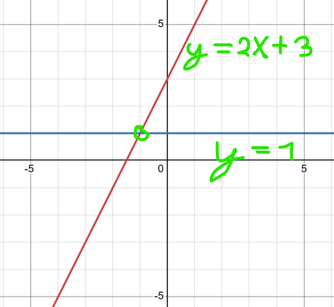
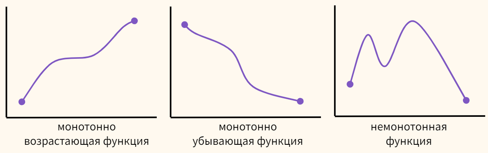
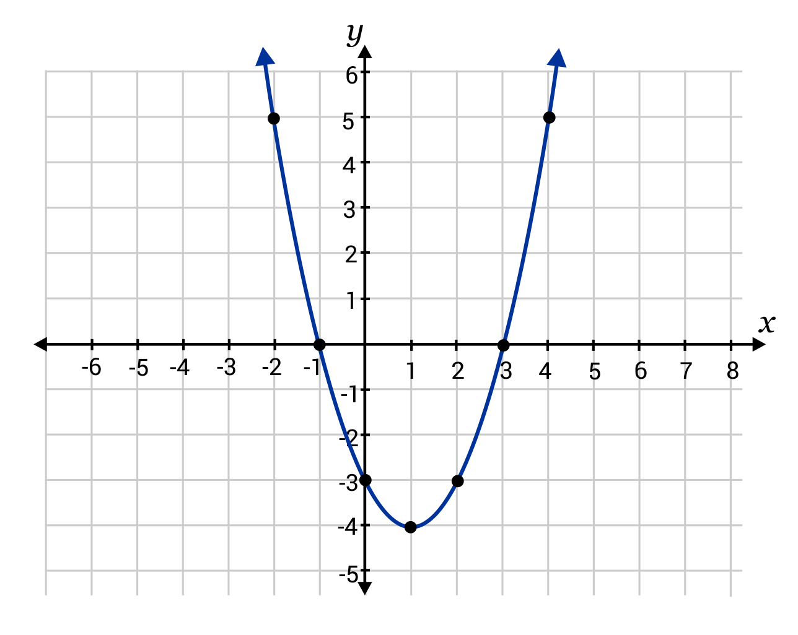

# Бинарный и тернарный поиск, 2 указателя

## Бинарный поиск

Рассмотрим следующую игру. Вася загадывает целое число от $1$ до $1000$. Петя в свою очередь может выбирать любое целое $x$ и спрашивать у Васи: «Загаданное тобой число меньше $x$?». Вася отвечает «Нет» или «Да». Петя хочет как можно быстрее выиграть в эту игру. Как ему это сделать? 

Простым решением будет спрашивать например по очереди числа $1$, $2$, $3$, и т.д., пока Вася не ответит «Да». Тогда ответом будет последнее названное число $-1$. Однако игра будет длитя долго, и в худшем случае необходимо будет перебрать все $1000$ чисел. А если загаданное число было бы например в промежутке от $1$ до $10^9$, то ребятам возможно не хватило бы даже целой жизни, чтобы завершить игру. Время работы такого алгоритмы оценивается как $\mathcal{O}(len)$, где $len$ - длина промежутка, на котором было загадано число.

Поэтому сделаем важное наблюдение. Если мы спросили некоторый $x$ и получили ответ «Нет», то загаданное число $\ge x$. Иначе, загаданное число $< x$. Таким образом можно считать например после первого вопроса что промежуток в котором было загаднно число был либо $[1; x-1]$, либо $[x; 1000]$ (в зависимости от полученного ответа). 

Выгоднее всего спросить $x = 500$ или $x = 501$, потому что в таком случае длина наибольшего из двух промежутков будет наименьшая (мы хотим минимизировать максимум среди длин двух отрезков). Если далее применить на оставшемся промежутке описанный выше алгоритм, то получится $500 + 1$ вопрос нам всего понадобится сделать. Уже добились уменьшения почти в $2$ раза. 

Отметим, что числа $500$ и $501$ взяты не просто так, а являются серединой исходного отрезка. Давай обозначим границу поиска, где лежит загаданное число как $[l; r]$, где в нашем случае $l = 1$ и $r = 1000$. Однако, далее для удобства мы будем работать не с отрезком $[l; r]$ ($l$ и $r$ включены в промежуток), а с полуинтервалом $[l; r)$ ($l$ включена в промежуток, а $r$ нет). Тогда $l = 1$, $r = 1001$. Использование полуинтервалов упрощает расчёты, так например длина промежутка тогда вычисляется как $r - l$, вместо $r - l + 1$. Помимо [отрезков и полуинтервалов существуют ещё и интервалы](https://ru.wikipedia.org/wiki/Промежуток_(математика)), но они обычно не удобны для использования в программировании. 

Итак, чтобы вычислить значение серидины полуинтервала ($m$), мы можем прибавить к левой границе половину длины полуинтервала ($m = l + (r - l)/2$), или ещё лучше, заметить что это на самом деле среднее арифметическое границ полуинтервала ($m = (l + r)/2$). Таким образом, в нашем случае $m = (1 + 1001) / 2 = 501$. Отметим, что мы будем производить целочисленное деление, поскольку работаем только в целых числах.

Наконец, чтобы достичь серьёзного улучшения по асимптотике алгоритма, будем делить промежуток на $2$ равные (или с разницей в длине на $1$) части, пока длина не станет равной $1$. Проследим как будет уменьшаться длина промежутка в нашем случае:
$$1000 \rightarrow 500 \rightarrow 250 \rightarrow 125 \rightarrow 63 \rightarrow 32 \rightarrow 16 \rightarrow 8 \rightarrow 4 \rightarrow 2 \rightarrow 1 $$

Таким образом, вместо $1000$ вопросов нам теперь достаточно делать не более $10$ вопросов, каждый раз деля промежуток на котором находится ответ на $2$ равные части. Это и есть бинарный (двоичный) поиск. 

Пусть длина изначального промежутка равна $len$. Для оценки времени работы алгоритма необходимо посчитать, сколько раз мы можем делить $len$ на $2$, пока оно не будет больше $1$. Это еквивалентно решению уравнения $2^x = len$. В математике решение уравнения вида $a^x = b$, где $a$ и $b$ некоторые константы, обозначается как $\log_ab$, что читается как *логарифм* $a$ по основанию $b$ (говоря простыми словами, в какую степень надо возвести $a$ чтобы получить $b$). 

Таким образом, количество операций бинарного поиска можно оценить как $\mathcal{O}(\log_2 len)$. Можно показать, что $\frac{\log_ab}{\log_cb} = const$, Потому основание логарифма можно не уточнять и писать в асимптотике $\mathcal{O}(\log len)$.

Наконец, заметим, что логарифм является медленно-растущей функцией. Так например, $\log_2 10^9 < 30$, и если с тривиальным алгоритмом ребятам могло не хватить и жизни, дабы закончить игру, то с бинарным поиском на всё про всё уйдёт несколько минут.

Пример кода по задаче:

```cpp
    int l = 1; // l включительно
    int r = 1001; // r не включительно, поэтому r > 1000
    while (r - l > 1) { // r - l = длина полуинтервала
        int m = (l + r) >> 1; // ">> 1" эквивалентно "/ 2". m - середина полуинтервала
        if (загадано меньше m) {
            r = m;
        } else {
            l = m;
        }
    }

    // l - ответ загаданное число. Ответом в других задачах/реализациях будет необязательно l, а например r (l + 1). думайте о том, где именно лежит ответ, после выполенния бинпоиска.
```

## Применимость бинарного поиска

Данный алгоритм является одним из самых важных и часто применямых. Его можно использовать, например, для решения таких задач, как:

* Проверка наличия определённого числа, в отсортированном массиве.
* Поиск индекса элемента в отсортированном массиве.
* Поиск слова в словаре.
* Задана прямая $y = k\cdot x + b$ ($k \neq 0$), найти при каком $x$ достигается $y = a$.

### Вещественный бинарный поиск

Остановимся на последнем пункте поподробнее. Ниже приведён графический пример такой задачи.



Понятно, что такая задача имеет простое аналитическое решение за $\mathcal{O}(1)$. простым решением уравнения вида $a = k\cdot x + b$. Но задача имеет и решение методом бинарного поиска. 

Возьмём $l$ заведомо не больше искомого $x$ и $r$ заведомо не меньше $x$. Тогда будем делить отрезок пополам, проверяя больше ли $y = m \cdot x + b$ чем $a$, или нет, и соответсвующим образом сдвигая одну из границ к центру отрезка. 

Теоретически, такое решение будет работать бесконечно долго, ведь на множестве вещественных чисел мы можем уменьшать длину отрезка в $2$ раза бесконечно долго. Однако, в реальных задачах обычно необходимо найти ответ с определённой точностью, которая достижима с использованием встроенных численных типов данных с плавающей точкой (`double`, `long double`, `float` и т.д.). Поэтому, будем уменьшать отрезок в $2$ раза до тех пор, пока его длина не будет меньше чем разрешённая погрешность. 

Пример кода для этой задачи:

```cpp
    // удобно в задачах на бинарный поиск выносить функцию проверки в отдельную сущность (иногда она используется несколько раз в коде, например при выводе ответа)
    double f(double x) {
        return k * x + b;
    }

    ...

    const double eps = 1e-9; // разрешённая погрешность
    double l = -1e100; // -(10^100)
    double r = 1e100; // 10^100
    while (r - l > eps) {
        double m = (l + r) / 2;
        if (f(m) < a) {
            l = m;
        } else {
            r = m;
        }
    }

    // ответ - любое число в промежутке [l; r]
```

Вместо `while (r - l > eps)` можно написать например `for (int _ = 0; _ < 200; _++)`, делая бинарный поиск не до определённой длины отрезка, а стараясь получить как можно меньшую длину за счёт большого числа итераций. Из минусов такого подхода $-$ долгое время выполнения, но когда это не критично, он является предпочительным. 

### Общий вид задач, где применим бинпоиск

Познакомимся с понятием монотонной функции. Функция является монотонной, если для всех $x_1 < x_2$ всегда верно либо $f(x_1) \le f(x_2)$ (монотонно неубывающая ф-я), либо $f(x_1) \ge f(x_2)$ (монотонно невозрастающая ф-я).



Бинарный поиск применим для поиска значения параметра ($x$) монотонной функции ($f(x)$), при котором она принимает определённое значение ($f(x) = a$).

Примеры таких функций:

* $f(x) = x^2$ (Для $x \ge 0$). С помощью такой функции можно для произвольного заданного положительного числа $n$ найти его корень с помощью бинарного поиска (что будет иметь большую точность, чем использование встроенной функции `sqrt`). 

* $f(x) = x^3$ (Для всех $x$).

* $f(x) = \frac{1}{x}$ (Для всех $x > 0$).

### Встроенный бинарный поиск

Для векторов/массивов и других последовательных контейнеров существуют функции `upper_bound` и `lower_bound`, реализующие бинарный поиск в отсортированном массиве. 

## Тернарный поиск

### Постановка задачи
Пусть дана функция $f(x)$, унимодальная на некотором промежутке $[l; r]$. Под унимодальностью понимается один из двух вариантов. Первый: функция сначала строго возрастает, потом достигает максимума (в одной точке или целом отрезке), потом строго убывает. Второй вариант, симметричный: функция сначала убывает, достигает минимума, возрастает. В дальнейшем мы будем рассматривать первый вариант, второй будет абсолютно симметричен ему.

Требуется найти максимум функции $f(x)$ на промежутке $[l; r]$.

Пример: найти экстремум параболы ($a \cdot x^2 + b \cdot x + c$).



### Алгоритм

Возьмём любые две точки $m_1$ и $m_2$ в этом отрезке: $l < m_1 < m_2 < r$. Посчитаем значения функции $f(m_1)$ и $f(m_2)$. Дальше у нас получается три варианта:

* Если окажется, что $f(m_1) < f(m_2)$, то искомый максимум не может находиться в левой части, т.е. в части $[l; m_1]$. В этом легко убедиться: если в левой точке функция меньше, чем в правой, то либо эти две точки находятся в области "подъёма" функции, либо только левая точка находится там. В любом случае, это означает, что максимум дальше имеет смысл искать только в отрезке $[m_1; r]$.

* Если, наоборот, $f(m_1) > f(m_2)$, то ситуация аналогична предыдущей с точностью до симметрии. Теперь искомый максимум не может находиться в правой части, т.е. в части $[m_2; r]$, поэтому переходим к отрезку $[l; m_2]$.

* Если $f(m_1) = f(m_2)$, то либо обе эти точки находятся в области максимума, либо левая точка находится в области возрастания, а правая — в области убывания (здесь существенно используется то, что возрастание/убывание строгие). Таким образом, в дальнейшем поиск имеет смысл производить в отрезке $[m_1; m_2]$, но (в целях упрощения кода) этот случай можно отнести к любому из двух предыдущих.


Таким образом, по результату сравнения значений функции в двух внутренних точках мы вместо текущего отрезка поиска $[l; r]$ находим новый отрезок $[l^\prime; r^\prime]$. Повторим теперь все действия для этого нового отрезка, снова получим новый, строго меньший, отрезок, и т.д.

Рано или поздно длина отрезка станет маленькой, меньшей заранее определённой константы-точности, и процесс можно останавливать. Этот метод численный, поэтому после остановки алгоритма можно приближённо считать, что во всех точках отрезка $[l; r]$ достигается максимум; в качестве ответа можно взять, например, точку $l$.

Осталось заметить, что мы не накладывали никаких ограничений на выбор точек $m_1$ и $m_2$. От этого способа, понятно, будет зависеть скорость сходимости (но и возникающая погрешность). Наиболее распространённый способ — выбирать точки так, чтобы отрезок $[l; r]$ делился ими на $3$ равные части:

$$m_1 = l + \frac{r - l}{3}$$
$$m_2 = r - \frac{r - l}{3}$$

Впрочем, при другом выборе, когда $m_1$ и $m_2$ ближе друг к другу, скорость сходимости несколько увеличится. Количество итераций $\log_{\frac{3}{2}} \frac{r - l}{eps}$, то есть асимптотичеки $\mathcal{O}(\log (r - l))$.

### Реализация

```cpp
    double l = ..., r = ..., eps = ...; // входные данные
    while (r - l > eps) {
    double m1 = l + (r - l) / 3,
        m2 = r - (r - l) / 3;
    if (f (m1) < f (m2))
        l = m1;
    else
        r = m2;
    }
```

Аналогично бинпоиску можно делать не до длины отрезка $eps$, а фиксированное число итераций циклом `for`.

### Целочисленный случай

Если аргумент функции $f(x)$ целочисленный, то полуинтервал $[l; r)$ тоже становится дискретным, однако, поскольку мы не накладывали никаких ограничений на выбор точек $m_1$ и $m_2$, то на корректность алгоритма это никак не влияет. Можно по-прежнему выбирать $m_1$ и $m_2$ так, чтобы они делили отрезок $[l; r)$ на $3$ части, но уже равные только приблизительно.

Второй отличающийся момент — критерий остановки алгоритма. В данном случае тернарный поиск надо делать пока $r - l > 3$, ведь в таком случае уже невозможно будет выбрать точки $m_1$ и $m_2$ так, чтобы были различными и отличались от $l$ и $r$, и это может привести к зацикливанию. После того, как алгоритм тернарного поиска остановится и станет $r - l \leq 3$, из оставшихся нескольких точек-кандидатов $(l, l + 1, \ldots, r - 1)$ надо выбрать точку с максимальным значением функции.

## 2 указателя

Метод, позволяющий решать задачу быстрее чем бинарный/тернарный поиск в ряде случаев. Начнём с рассмотрения примера задачи

### Задача

Дан отсортированный по возрастанию массив целых чисел $a_i$ и целевое число $X$. Необходимо определить, существуют ли в массиве два различных элемента, сумма которых равна $X$.

#### Решение бинарным поиском

Переберём первое число в этой паре с индексом $i$. Бинарным поиском, найдём в массиве элемент равный $X - a_i$. Если такого нет $-$ переходим к следующему $i$. Если есть $-$ то мы нашли ответ. Отдельно обработаем случай $2 \cdot a_i = X$.

Время работы $\mathcal{O}(n \cdot \log n)$.

Решим быстрее.

#### Решение через 2 указателя

Всё также переберём первое число в этой паре с индексом $i$. Но заметим, что с увеличением $i$, индекс $j$ (второго элемента в паре) может либо сохраниться, либо уменьшиться. Для удобства вместо $i$ можно использовать $l$ и вместо $j$ $-$ $r$. Тогда при переходе к следующему $l$ проверим, правда ли, что $a_l + a_r$ меньше $X$, и если нет, то будем сдвигать пока не станет меньше. Если в какой-то момент оказалось равно $-$ мы нашли ответ.

Пример реализации:

```cpp
    for (int l = 0, r = n - 1; l < r; l++) {
        while (l < r && a[l] + a[r] > X) r--;
        if (l == r) break;
        if (a[l] + a[r] == X) {
            cout << "Ответ найден";
            exit(0);
        }
    }
    cout << "Ответ не найден";
```
