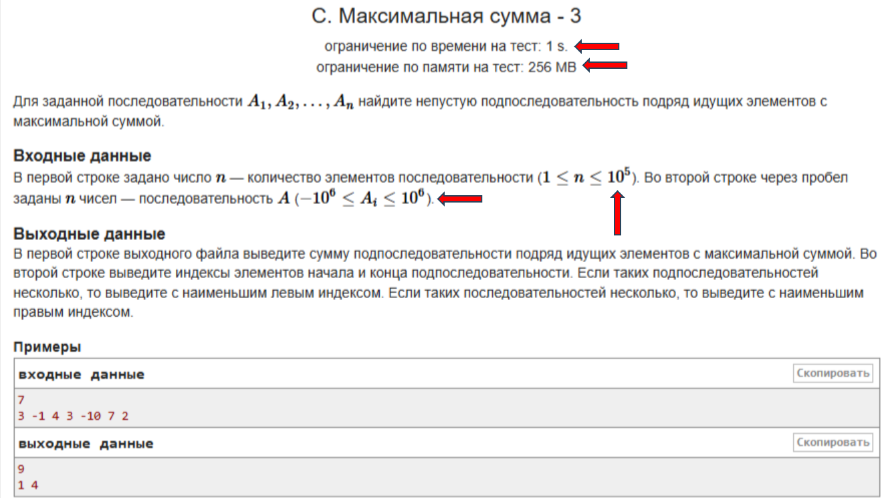

# Вводное занятие

Перед первым уроком рекомендуется установить и настроить среду разработки. Можете сами выбрать среду, которую хотите использовать. В свою очередь можем предложить [такую методичку](https://github.com/kolychestiy/olymp/tree/main/Настройка%20компьютера), если не знаете что хотели бы установить. 

## Предметная область

Данный курс нацелен на обучение теории и навыкам решения задач с олимпиад по программированию. В рамках курса будут рассматриваться различные классические алгоритмы и структуры данных, методы решения олимпиадных задач. Предлагаются к решению задачи по каждой теме, что является основой обучения (подкрепление знаний непосредственной практикой).

Олимпиада по программированию $-$ соревнование, проводимое в несколько часов (обычно 5), где участникам предлагаются для решения несколько задач. Существуют различные олимпиады. Самой известной в РФ является Всероссийская олимпиада школьников (ВсОШ). Проводится в 4 этапа: школьный, муниципальный, региональный, заключительный (всероссийский). Знания изучаемые в рамках курса применимы на всех этапах ВсОШ. Призовое место на заключительном этапе ВсОШ даёт БВИ в сильнейшие вузы страны. Помимо ВсОШ существует [ряд других олимпиад](https://postupi.online/olimp-list/?fsubject=49&flevel=5), предоставляющих БВИ в вузы.

На очной олимпиаде участникам обычно запрещено использовать любые средства связи, электронные устройства (кроме предоставляемого организаторами компьютера), проверяется умение решать нетривиальные задачи без посторонней помощи. В рамках курса мы не будем подробно останавливаться именно на подготовке к таким условиям, а поговорим об используемых знаниях и умениях, которые нужны для решения задач. Также стоит отметить, что обычно на школьной олимпиаде в задачах можно получать частичные баллы, за хорошие, но не оптимальные решения. В задачах курса же принимается только полное решение, без частичных баллов. В случае необходимости самостоятельно найти тренировку в таком формате (и написать её в виртуальном участии, то есть симулируя реальное соревнование, не отрываяюсь, на протяжении нескольких часов), можно например на codeforces, в том числе по [этой ссылке](https://codeforces.com/gyms?filterContestType=Official+School+Contest&filterContestFormat=IOI&order=ID_DESC) с уже выставленными фильтрами.

Наконец отметим, что освоение данного курсе не гарантирует хороших результатов на олимпиадах, ведь помимо знания алгоритмов и структур данных важно также и умение решать задачи, и регулярная практика участия в олимпиадах, с изучением разборов нерешённых задач и их дорешиванием.

## Ответ $-$ это алгоритм

В олимпиадах по математике часто встречаются задачи, ответом на которые является конкретное число. Мы же будем изучать такие задачи, ответом на которые будет являться алгоритм. А именно исходный код на языке программирования (в рамках курса на C++).

Если задача по математике выглядит например так: найдите сумму ряда чисел $1, 2, \ldots, 100$, и ответом будет $5050$, то в задаче по программированию вас попросят например найти сумму ряда чисел $1, 2, \ldots, n$, где $n$ $-$ это некоторое значение, подаваемое на ввод вашей программы. И ваша программа должна реализовать алгоритм, решающий задачу сразу для большого количества возможных значений $n$.

## Ограничения в задачах



На снимке выше выделены основные моменты связанные с ограничениями для задач по спортивному программированию. Это время выполнения программы на одном тесте, память используемая программой на одном тесте и чётко прописанные ограничения на входные данные в задаче (нужно внимательно читать всё условие, включая легенду, формат входных и выходных данных).

Различные алгоритмы будут совершать различное количество операций различных типов за одну секунду. И у компьютера есть определённая скорость выполнения этих операций. Разные языки имеют различную усреднённую скорость работы. C++ является лидером по этому показателю среди других ЯП высокого уровня (потому и используется на олимпиадах). Также $C++$ позволяет эффективно использовать другие ресурсы, такие как память компьютера.

$C++$: примерно $10^8−10^9$ операций в секунду

$Python$: примерно $10^6−10^7$ операций в секунду

### Попробуйте сами

Напишите цикл, который вычисляет сумму чисел от $1$ до $n$, а затем выводит её. Найдите примерное значение $n$ когда цикл начинает работать более пары секунд. Предварительно научитесь прерывать выполнение программы (обычно ctrl + C в терминале).

Напишите цикл, который выводит числа от $1$ до $100$. До $10^4$. До $10^6$. Здесь можно проследить, что операции ввода/вывода являются очень дорогими. В этой задаче рекомендуется использовать файловый ввод/вывод.

Попробуйте аналогичные действия в других языках (не $C++$).

## Быстрый ввод-вывод

Как отмечено выше, операции ввода/вывода каких-либо данных занимают много процессорного времени. Так например, если у вас в задаче порядка $10^6$ чисел, то есть риск даже не успеть их прочитать. Для того, чтобы не попадать в такую ситуацию, сущестует простое решение которое рекомендуется ВСЕГДА использовать в своих исходных кодах на $C++$, если вы сдаёте задачу по олимпиадному программированию. Не вдаваясь в детали, в начале функции $main$ достаточно добавить $2$ следующие строчки:

```cpp
    ios_base::sync_with_stdio(0);
    cin.tie(0);
```

Грубо говоря, они позволяют убрать синхронизацию потоков ввода/вывода и делать сброс буфера вывода только в конце выполнения программы. При необходимости вывести данные из буфера вывода, до конца выполнения программы, можно использовать $flush$ или $endl$.

## Асимптотика

### Введение

Асимптотика – это способ оценить скорость работы алгоритма при увеличении объёма входных данных. Она помогает понять, как быстро растёт время выполнения программы, если ввод становится всё больше. Этот подход используется для сравнения алгоритмов независимо от компьютера или языка программирования.

Когда мы пишем программу, важно знать, как она поведёт себя на больших данных. Один алгоритм может работать мгновенно при 10 элементах, но очень долго при 100000 элементах. Асимптотика помогает нам заранее оценить — насколько медленно или быстро растёт время работы.

### Немного теории

    Можно начать с примеров, для использования асимптотических оценок не обязательно (но желательно) по началу понимать теорию.

Пусть:

$n$ $-$ размер входных данных (например, количество элементов в списке);

$f(n)$ $-$ количество операций, которое выполняет алгоритм.

Тогда запись $f(n)=O(g(n))$ означает, что функция $f(n)$ растёт не быстрее, чем $g(n)$ (с точностью до константы).

Другими словами, $f(n)$ ограничена сверху функцией $g(n)$:

$f(n) \le c \cdot g(n)$ для всех $n$, где $c>0$ некоторое константное число.

Это называется оценкой сверху. Мы смотрим, каков худший случай для алгоритма при большом $n$.

### Примеры

$\mathcal{O}(n)$
```cpp
    for (int i = 0; i < n; i++) {
        cout << i << ' ';
    }
```
Тоже $\mathcal{O}(n)$
```cpp
    for (int i = 3; i < 10*n; i++) {
        cout << i << ' ';
    }
    int sum = 0;
    for (int i = 2; i < n; i++) {
        sum += 2 * i * i;
    }
```
$\mathcal{O}(n^2)$
```cpp
    for (int i = 0; i < n; i++) {
        for (int j = i; j < n; j++) {
            cout << i + j << ' ';
        }
    }
```
Тоже $\mathcal{O}(n^2)$
```cpp
    int sum = 0;
    for (int i = 0; i < n; i++) {
        sum += i;
    }
    for (int i = 0; i < n; i++) {
        for (int j = i; j < n; j++) {
            cout << i + j << ' ';
        }
    }
```
$\mathcal{O}(n \cdot m + q)$
```cpp
    for (int i = 0; i < n; i++) {
        for (int j = 0; j < m; j++) {
            cout << i + j << ' ';
        }
    }
    for (int k = 0; k < q; k++) {
        cout << k << ' ';
    }
```
$\mathcal{O}(1)$
```cpp
    for (int i = 0; i < 42; i++) {
        cout << i << ' ';
    }
```

### Итог

Не нужно считать точное количество операций — главное понять, насколько быстро увеличивается время, когда увеличивается размер входных данных. Эта оценка позволяет заранее выбрать более эффективные алгоритмы.

Асимптотика (O-большое) показывает, как быстро растёт время (или память) выполнения алгоритма при увеличении размера входных данных. Она помогает сравнивать алгоритмы по скорости, независимо от машины и языка программирования.

## Задача "Максимальная сумма"

Разбор задачи смотрите в презентации.

## Задача "Сумма на отрезке"

Для решения задачи "Сумма на отрезке" воспользуемся префиксными суммами.

Префикс $i$ массива $a$ это отрезок $a_1$, $a_2$, $\ldots$, $a_i$.

Префиксная сумма: $s_i = \sum^i_{j=1}a_j$. Здесь и далее $\sum$ обозначает операцию суммирования всех слагаемых по определённому правилу. Перебирается $j$ от нижнего значения ($1$) и до верхнего ($i$). То есть, $\sum^i_{j=1}a_j = a_1 + a_2 + \ldots + a_i$

Тогда для любого отрезка $a_l, a_{l+1}, \ldots, a_r$ верно: $\sum^r_{j=l}a_j = s_r - s_{l-1}$

Значения $s_i$ можно вычислять последовательно. $s_0 = 0$, а далее верно $s_i = s_{i-1} + a_i$. То есть для подсчёта всех $s_i$ можно написать следующий код:

```cpp
    vector<int> s(n + 1);
    for (int i = 1; i <= n; i++) {
        s[i] = s[i - 1] + a[i - 1];
    }
```

Получаем $\mathcal{O}(n)$ время предпосчёта префиксных сумм и $\mathcal{O}(1)$ времени для ответа на запрос.

