# Настройка VS Code

> Перед установкой VS Code рекомендуется [установить компилятор C++](Установка%20компилятора%20для%20C++.md).

---

## 1. Скачайте и установите VS Code

👉 **<https://code.visualstudio.com/>**

В установщике со всем соглашайтесь.

## 2. Установите расширения

Слева нажмите на иконку из **4 плиточек** (Extensions), введите название расширения в строке поиска и нажмите **Install**.

**Русский язык** (по желанию) — ищите `russian`:

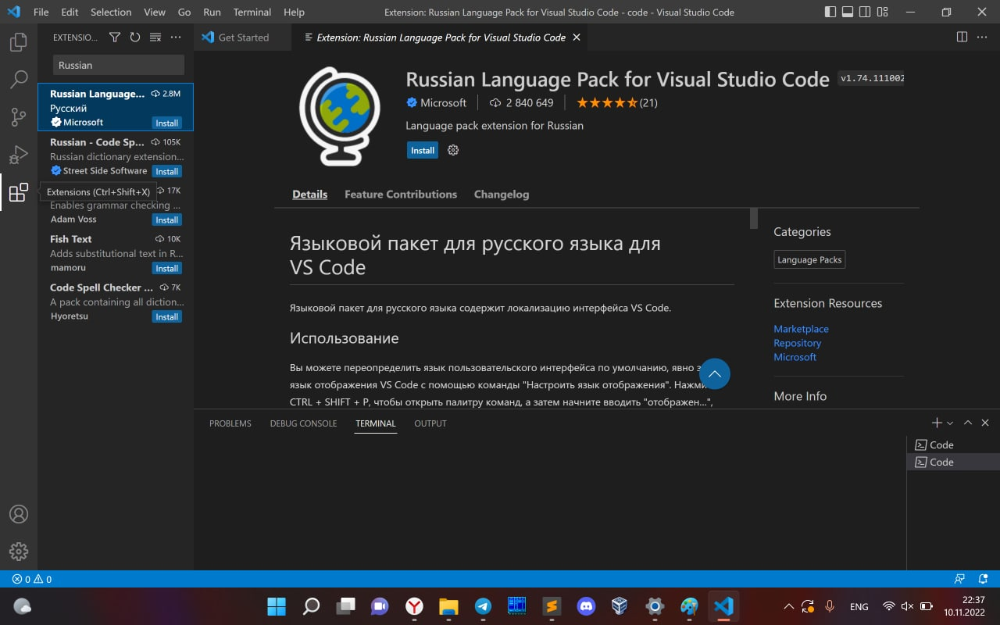

**C/C++**:

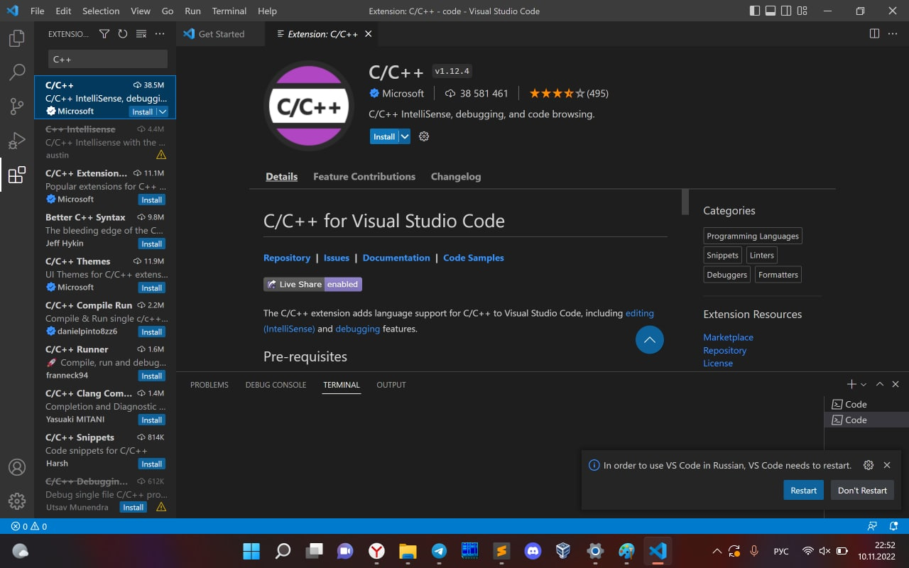

**Code Runner**:

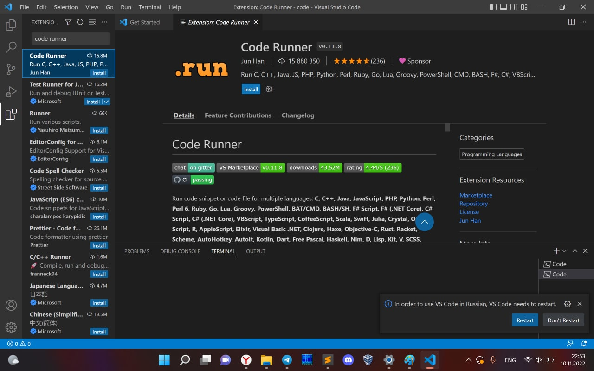

После установки перезапустите VS Code.

## 3. Горячие клавиши

| Действие | Комбинация |
|---|---|
| Создать новый файл | <kbd>Ctrl</kbd> + <kbd>N</kbd> |
| Сохранить файл | <kbd>Ctrl</kbd> + <kbd>S</kbd> |
| Открыть существующий файл | <kbd>Ctrl</kbd> + <kbd>O</kbd> |
| Переключиться между терминалом и редактором | <kbd>Ctrl</kbd> + <kbd>&#96;</kbd> (клавиша с `~`) |
| Палитра команд | <kbd>Ctrl</kbd> + <kbd>Shift</kbd> + <kbd>P</kbd> |
| Запустить код (Code Runner) | <kbd>Ctrl</kbd> + <kbd>Alt</kbd> + <kbd>N</kbd> |

Попробуйте: создайте файл (<kbd>Ctrl</kbd> + <kbd>N</kbd>) и сразу сохраните его (<kbd>Ctrl</kbd> + <kbd>S</kbd>) под именем, например, `main.cpp`. Теперь в нём можно писать код и запускать его.

## 4. Включите автосохранение

Откройте палитру команд (<kbd>Ctrl</kbd> + <kbd>Shift</kbd> + <kbd>P</kbd>), наберите `auto` и выберите пункт **«Включить/отключить автоматическое сохранение»**.

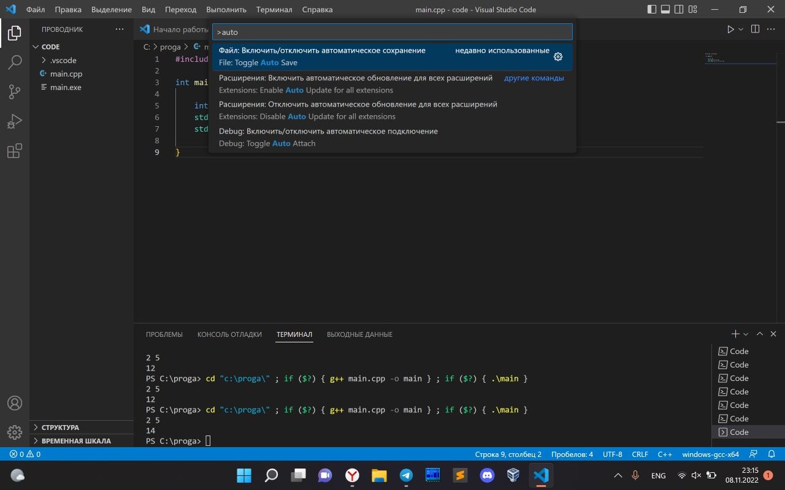

По умолчанию файл сохраняется раз в секунду — это довольно долго. Уменьшим задержку:

**Файл → Настройки → Параметры**

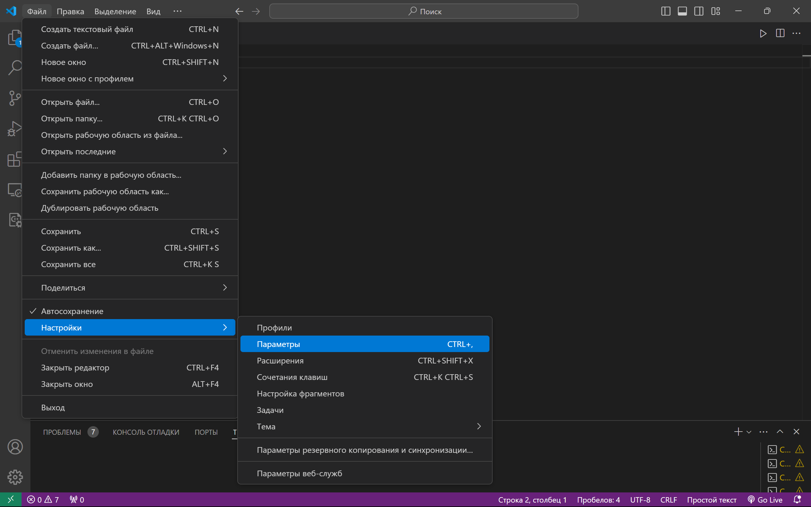

В строке поиска наберите `auto save delay` и укажите задержку в миллисекундах (например, `50`).

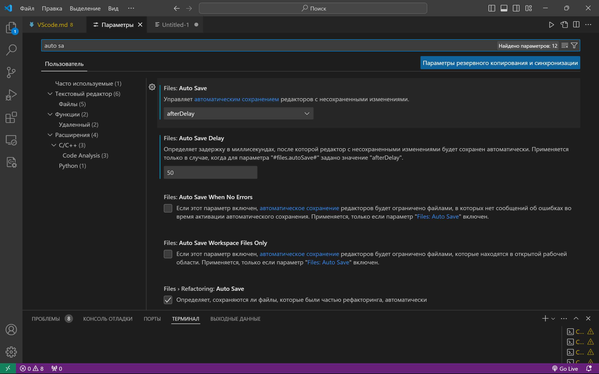

> 💡 **Альтернатива.** Чтобы не нагружать компьютер сохранением каждые 50 мс, можно вместо этого включить сохранение файла при запуске кода через Code Runner. Рекомендую первую из двух настроек на скриншоте:
>
> 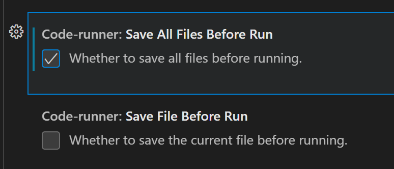

## 5. Запуск в терминале

По умолчанию Code Runner запускает код не в терминале, и ввести входные данные не получится. Исправим это: в настройках найдите `run in terminal` и поставьте галочку.

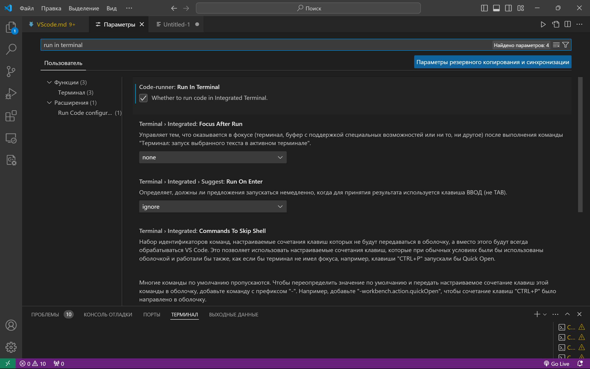

## 6. Запуск кода

Запустить код можно двумя способами:

- комбинацией <kbd>Ctrl</kbd> + <kbd>Alt</kbd> + <kbd>N</kbd> *(рекомендуется)*;
- мышкой: нажмите на **треугольничек** справа сверху и выберите **Run Code**.

Внизу откроется терминал, в котором запустится код из открытого файла.

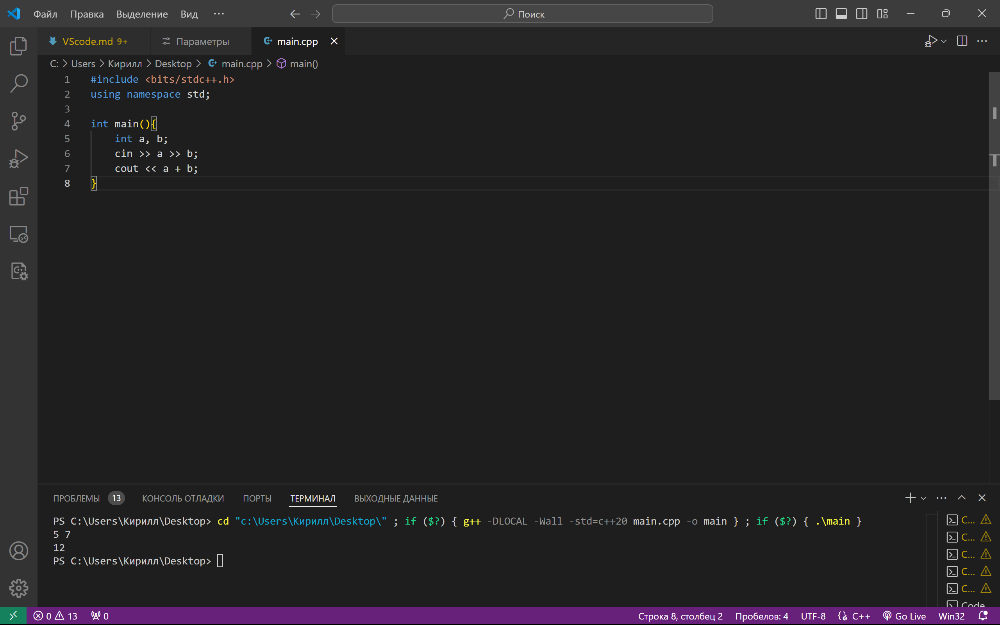

> ⚠️ Если перед запуском выделить часть кода, запустится **только выделенный фрагмент**, а не весь файл.
>
> 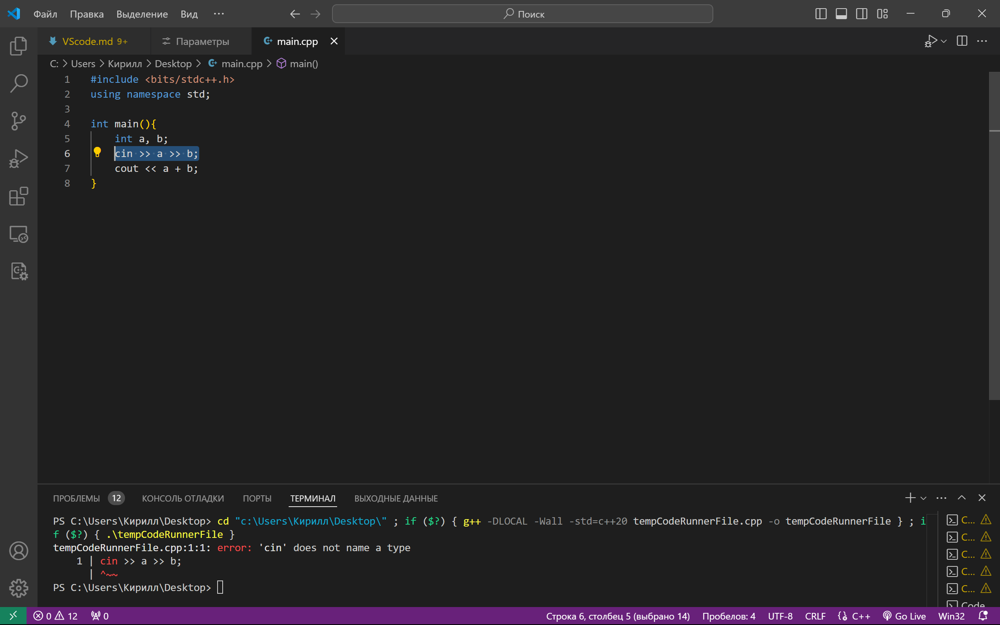
>
> В примере выше вместо файла из 8 строк был создан новый файл (видно по изменившемуся имени в команде в терминале), куда вставлен только выделенный текст, начиная с 6-й строки. В новом файле эта строка стала первой.

## 7. Настройка команды запуска

У Code Runner есть команды по умолчанию, которые подставляются в терминал при запуске файлов на разных языках. Рекомендую сразу поменять две из них — для **C++** и для **Python**.

В настройках найдите `code-runner: Executor Map`:

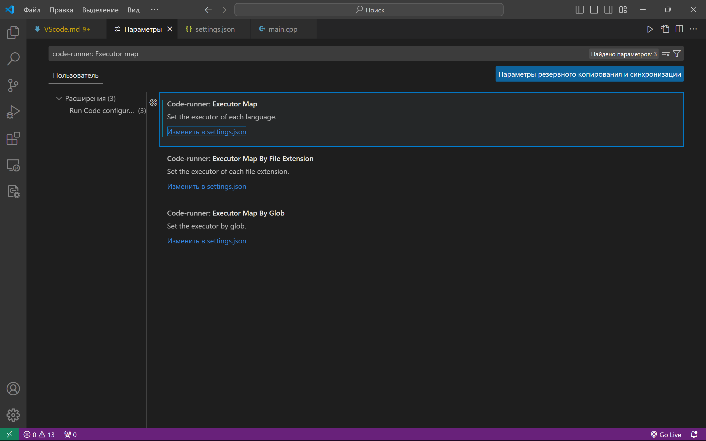

Нажмите **Изменить в settings.json**. Откроется файл конфигурации, где для каждого языка задана команда запуска.

> В меню на скриншоте выше можно настраивать команды не по языку, а по расширению файла, но пока хватит настройки по языку.

На скриншоте в 25-й строке — команда для C++ (`cpp`), в 28-й — для Python (`python`):

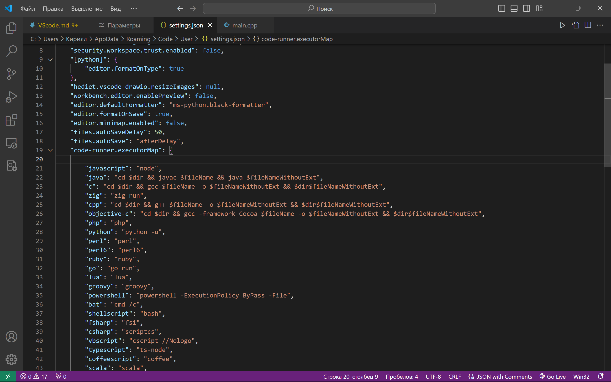

**Python.** Команда для C++ по умолчанию сначала переходит в папку с файлом. Сделаем так же для Python:

```json
"python": "cd $dir && python $fileName",
```

**C++.** Команду можно оставить как есть, но я рекомендую добавить 3 ключа:

```json
"cpp": "cd $dir && g++ -DLOCAL -Wall -std=c++20 $fileName -o $fileNameWithoutExt && $dir$fileNameWithoutExt",
```

| Ключ | Что делает |
|---|---|
| `-Wall` | Показывает все предупреждения компилятора о потенциальных ошибках в коде |
| `-std=c++20` | Компилирует по стандарту C++20 (в некоторых старых компиляторах его нет — тогда ключ не сработает) |
| `-DLOCAL` | То же самое, что написать `#define LOCAL` в начале файла |

## 8. Файловый ввод-вывод

Благодаря ключу `-DLOCAL` можно сделать так, чтобы **у вас локально** ввод и вывод шли через файлы, а **в тестирующей системе** — как обычно, без них:

```cpp
#include <bits/stdc++.h>
using namespace std;

int main() {

    #ifdef LOCAL
        freopen("input.txt", "r", stdin);
        freopen("output.txt", "w", stdout);
    #endif

    int a, b;
    cin >> a >> b;
    cout << a + b;

}
```

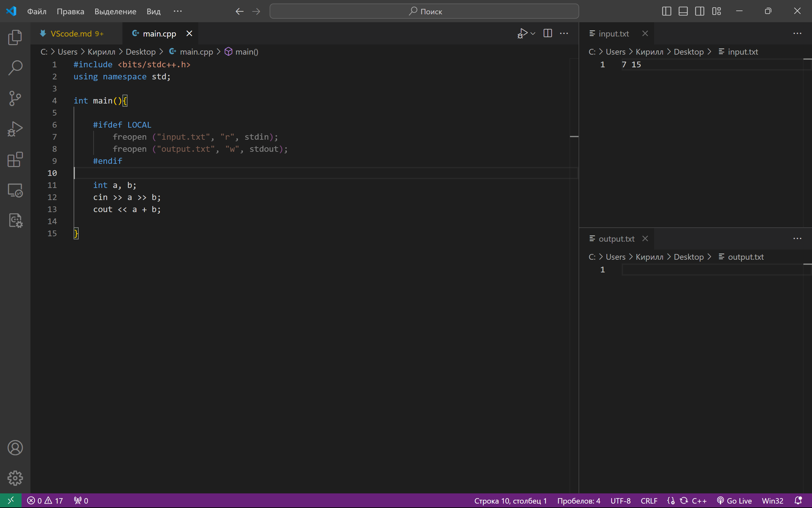

Создайте рядом с кодом файлы `input.txt` и `output.txt` и откройте их в VS Code. Перетащите вкладки так, чтобы `input.txt` был справа сверху, а `output.txt` — справа снизу. Получится удобная среда для тестирования.

Впишите входные данные в верхний файл, запустите код — и результат появится в нижнем.

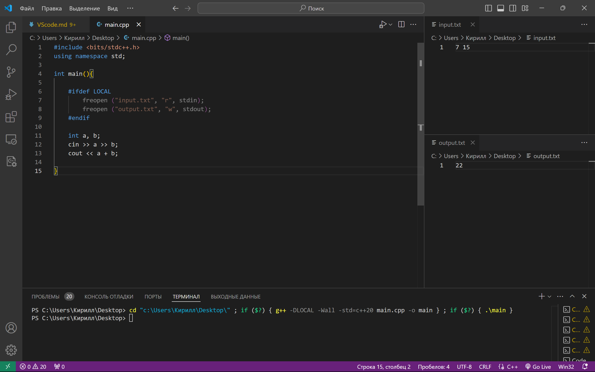
