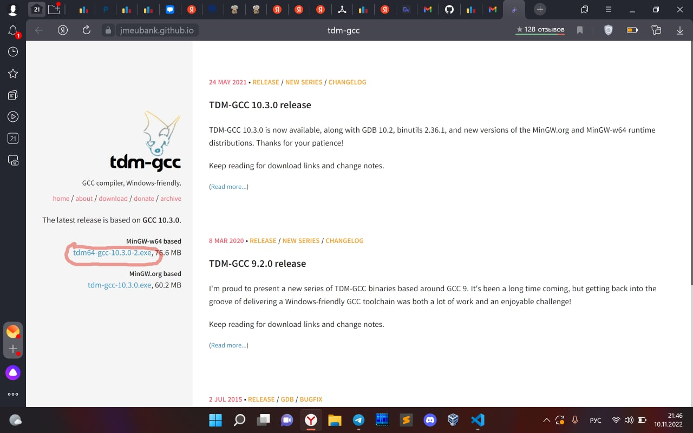
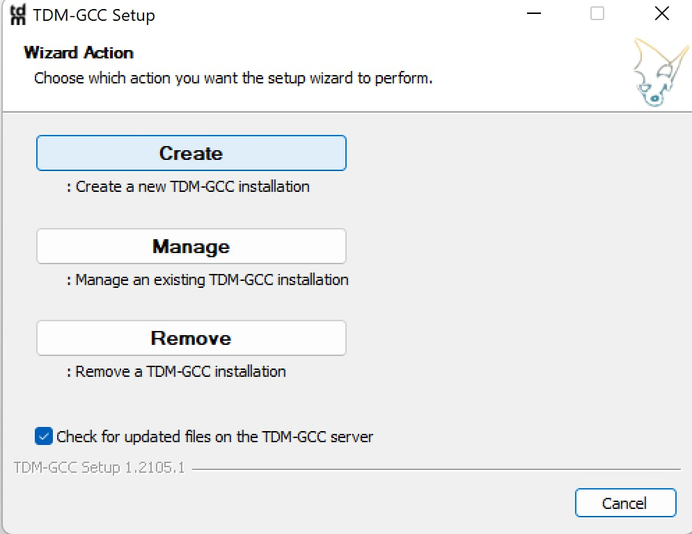
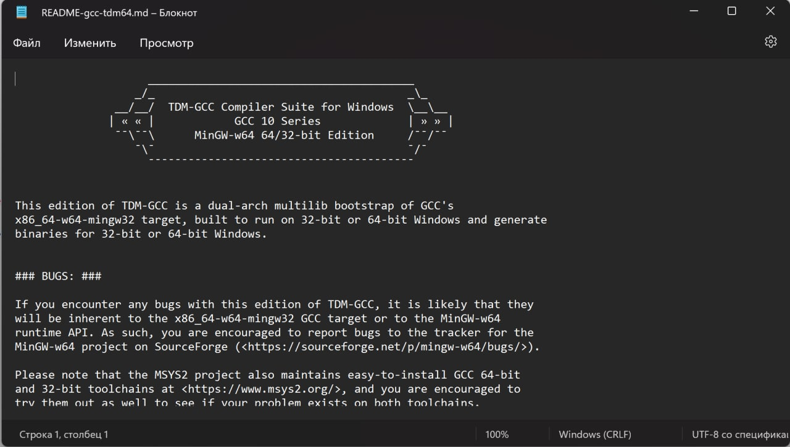

# Установка компилятора C++

> Инструкция для **Windows**. Будем ставить компилятор **TDM-GCC**.

---

## 1. Скачайте установщик

Перейдите на сайт TDM-GCC и скачайте установщик:

👉 **<https://jmeubank.github.io/tdm-gcc/>**



## 2. Запустите установщик

Нажмите **Create**, затем со всем соглашайтесь (**Next** → … → **Install**) и дождитесь окончания установки.



## 3. Закройте текстовый файл

После установки может открыться такой текстовый файл — его можно просто закрыть.



## 4. Проверьте установку

Откройте командную строку (<kbd>Win</kbd> + <kbd>R</kbd> → `cmd` → <kbd>Enter</kbd>) и выполните:

```
g++ --version
```

Если в ответ выводится версия компилятора — всё готово ✅

---

## Что дальше?

Компилятор установлен. Рекомендую перейти к [настройке VS Code](Настройка%20VS%20code.md).
