Перед установкой VS code рекомендуется [установить компилятор C++](https://github.com/kolychestiy/olymp/blob/main/Настройка%20компьютера/установка%20компилятора%20C++.md).

1.  Скачать и установаить VS code

    https://code.visualstudio.com/

    соглашаемся со всем.

2.  Установка расширений

    Рекомендую установить расширение для русского языка.
    
    Для этого слева щелкаем на иконку 4 плиточек, затем вводим russian в поисковой строке и находим это расширение. жмем кнопку install.

    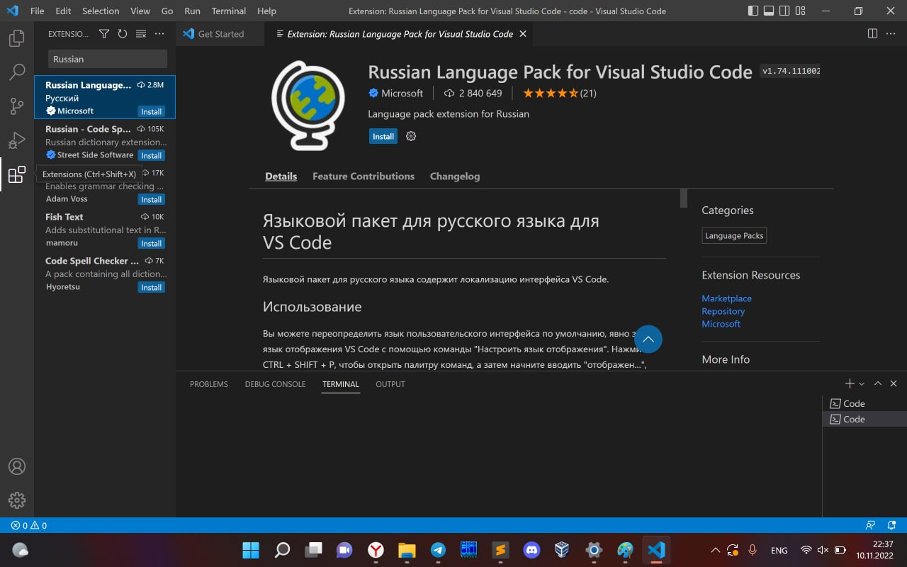

    Затем устанавливаем расширение C/C++

    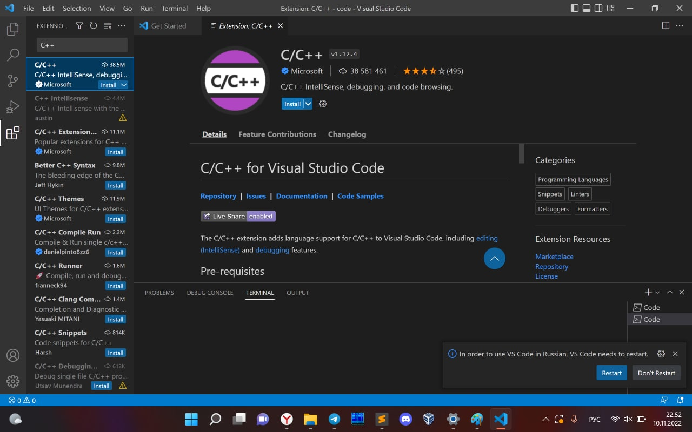

    Так же устанавливаем расширение code runner

    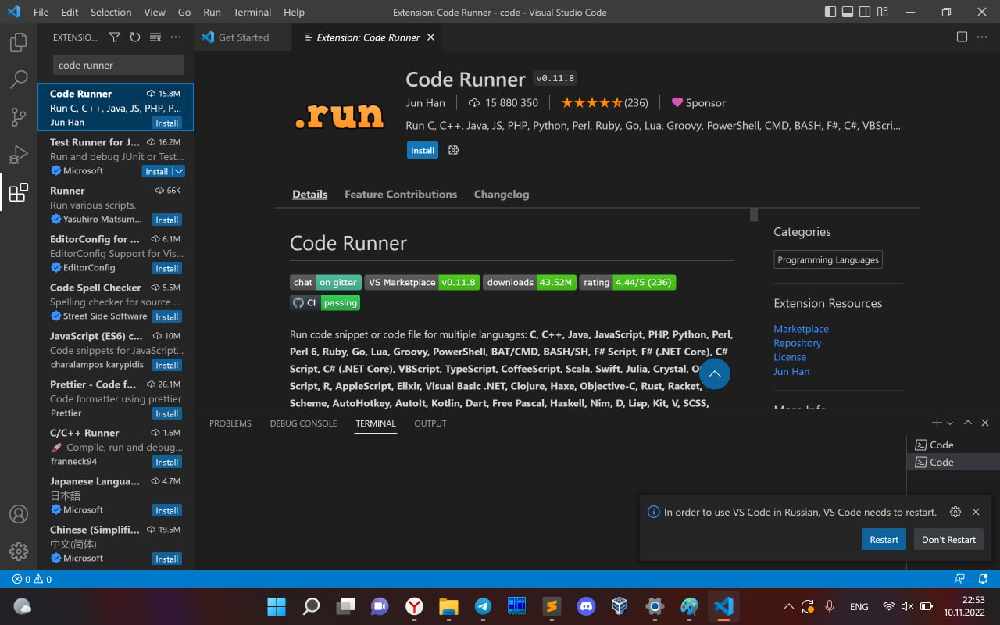

    Перезапускаем VS code.

3.  Ликбез по горячим клавишам.

    Создадим файл используя комбинацию клавиш ```ctrl + n```.

    Откроется пусте окошко, сразу же сохраним его, нажав ```ctrl + s```. В названии файла можно указать например "main.cpp".

    Теперь в этом файле можно писать код, который в дальнейшем можно будет запускать.

    Если у вас уже создан файл, и вы хотите его открыть, нажимаем ```ctrl + o```.

4.  Рекомендую включить автосохранение файлов

    для этого откройте палитру команд (```crtl + shift + p```)

    набираете auto, и ищите пункт включить/отключить автоматическое сохранение.

    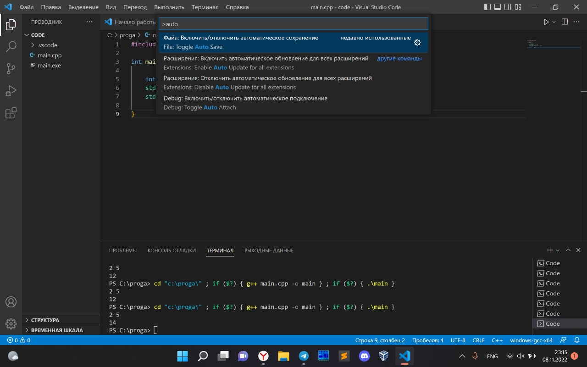

    По умолчанию файл автоматически сохраняется раз в секунду. Достаточно долгая задержка, потому в настройках выставим значение поменьше:

    файл -> настройки -> параметры

    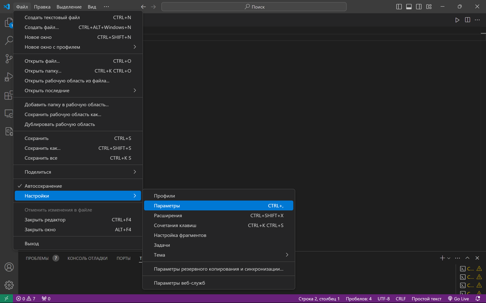

    в строке поиска начнём набирать "auto save delay", и под соответсвующим пунктом выставим новое время задержки для автосохранения в милисекундах (например 50)

    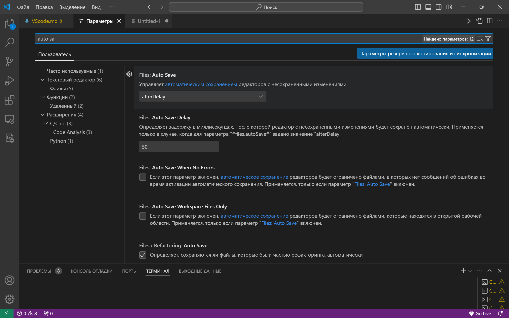

5.  По умолчанию расширение code-runner запускает файлы не в терминале. 

    Исправим это в настройках.

    Найдём настройку "run in terminal" и выставим галочку.

    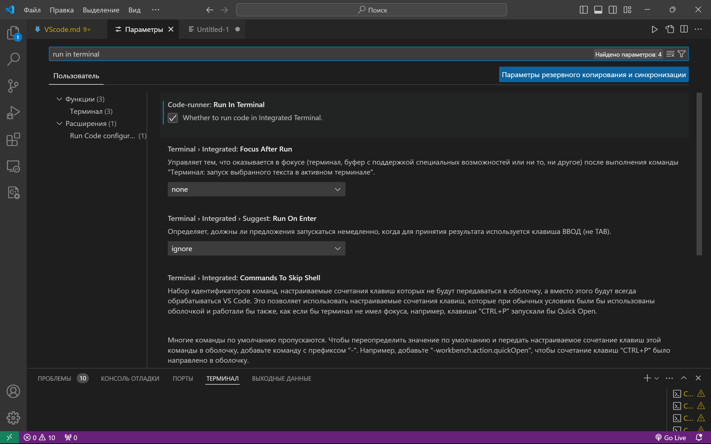
    
6.  Запуск кода

    Для запуска кода рекомендуется использовать комбинацию клавиш ctrl + alt + n
    
    Альтернативный метод с помощью мышки: нажать на треугольничек справа сверху и в выпадющем меню выбрать пункт "run code"

    Оба способа приведут к тому, что внизу экрана появится терминал, где будет запущен код из открытого файла.

    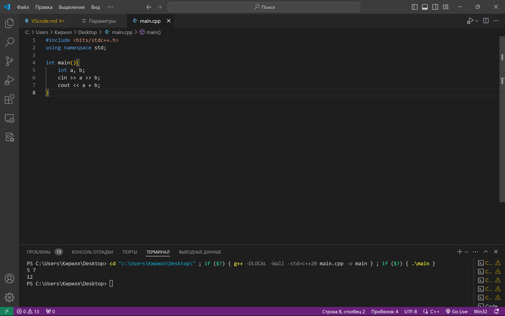

    Если при попытке запуска кода, вы выделите какой то блок текста, то будет запущен не открытый файл, а только тот блок кода, который вы выделили

    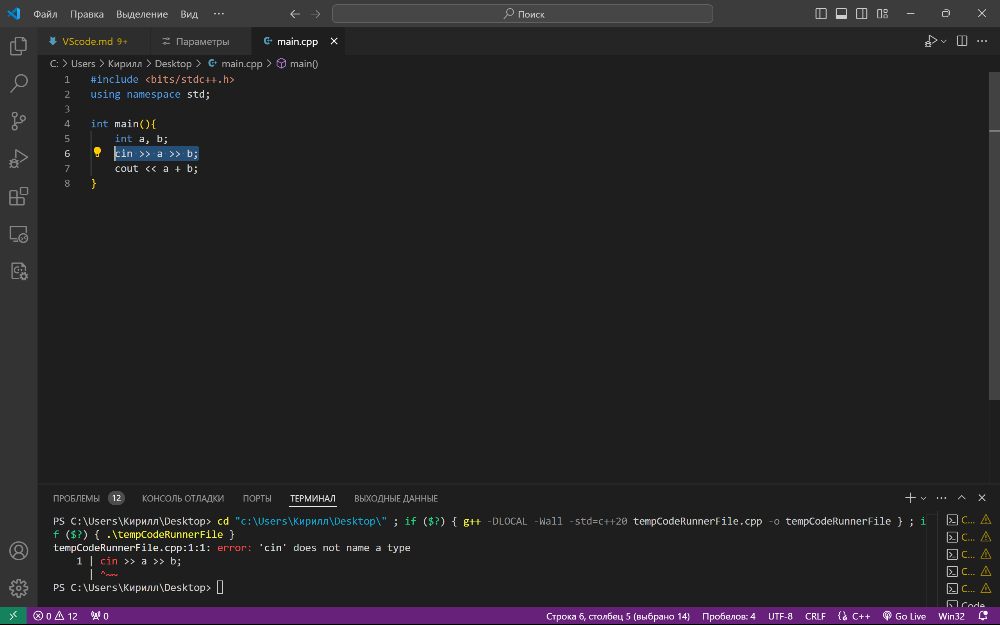

    В примере выше, вместо нашего файла из 8 строчек был создан новый файл (что видно из команды в терминале, так как имя файла изменилось), в который был вставлен выделенный нами текст (со строки 6). Номер этой строки в новом файле - 1.

7.  Настройка команды запуска

    По умолчанию расширение code-runner имеет некоторые команды, которые вставляются в терминал при запуске файлов на популярных языках программирования.

    Для упрощения жизни, рекомендую сразу изменить 2 команды компиляции по умолчанию - для C++ и для python.

    Для этого найдём расширение code-runner: Executor map

    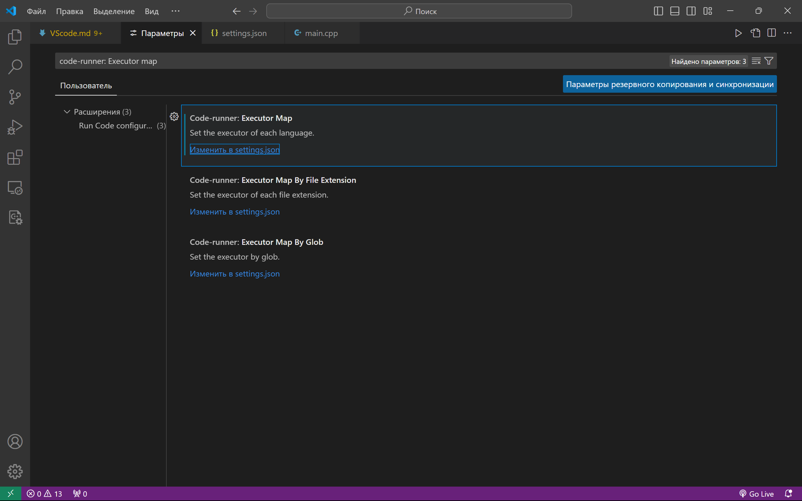

    Нужмём изменить в settings.json. Откроется файл конфигурации, где можно для языка писать команду компиляции при его запуске. 
    
    В меню на фото выше, можно выбрать конфигурацию не по языку, а по расширению файла, но пока нам хватит выбора по языку. 

    На фото в 25 строчке видна команда для C++ (cpp) на 28 строчке команда для питона (python)

    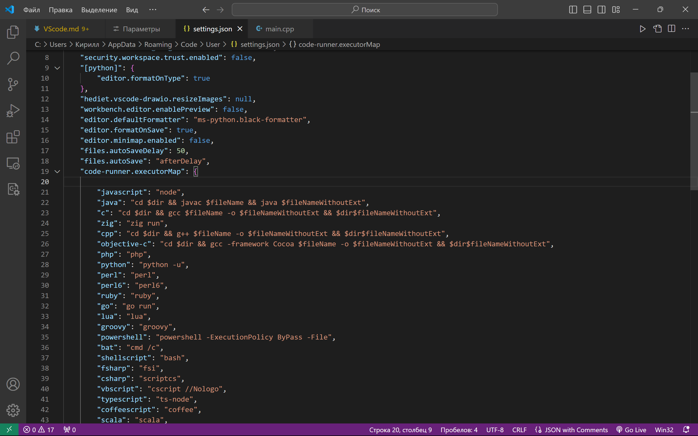

    C++ по умолчанию имеет в команде переход в папку с файлом, заменим по аналогии строку для запуска python на такую:

    ```"python": "cd $dir && python $fileName",```

    Команда для запуска C++ может остаться без изменений, но я же рекомендую добавить 3 ключа:

    ```"cpp": "cd $dir && g++ -DLOCAL -Wall -std=c++20 $fileName -o $fileNameWithoutExt && $dir$fileNameWithoutExt",```

    Ключ ```-Wall``` будет отображать все предупреждения компилятора, о потенциальных ошибках в коде.

    Ключ ```-std=c++20``` указывает, какой стандарт нужно использовать для компиляции (В некоторых компиляторах $20$-й стандарт отсутствует, потому ключ может заработать не везде)

    Ключ ```-DLOCAL``` аналогичен указанию в начале файла с кодом строки ```#define LOCAL```. 

8.  Файловый ввод-вывод

    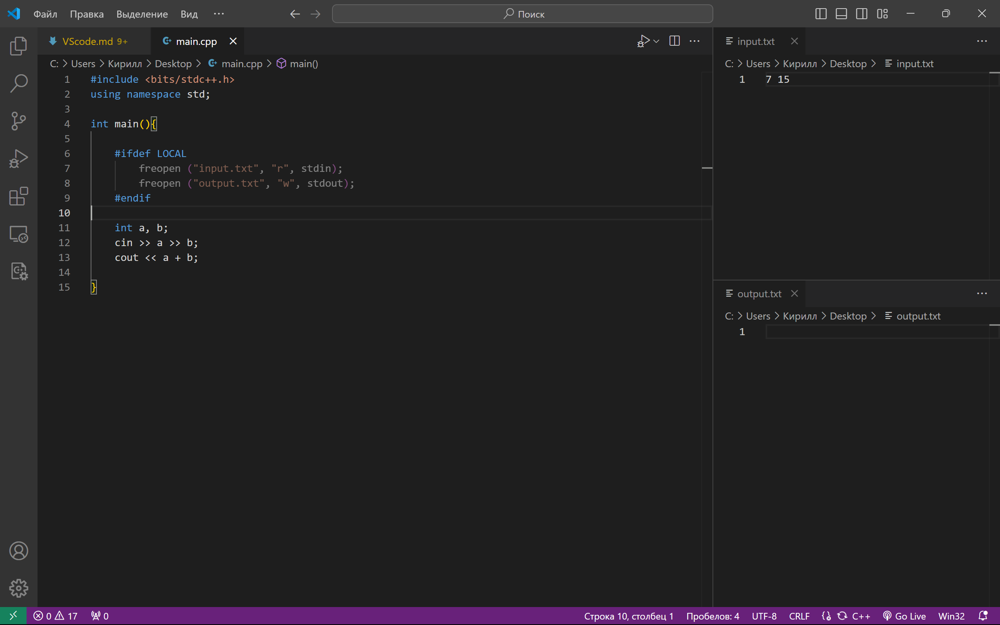

    Таким образом, написав условие по define-у локально ввод и вывод будут через файлы, а в тестирующей системе без них.

    Создадим файл для ввода и файл для вывода, откроем в VS code и затем перетаскиванием иконки файла поставим input.txt справа сверху, output.txt справа снизу, таким образом создав себе удобную среду для тестирования.

    Введём все входные данные для задачи в файл сверху, запустим код и увидим результат в файле снизу. 

    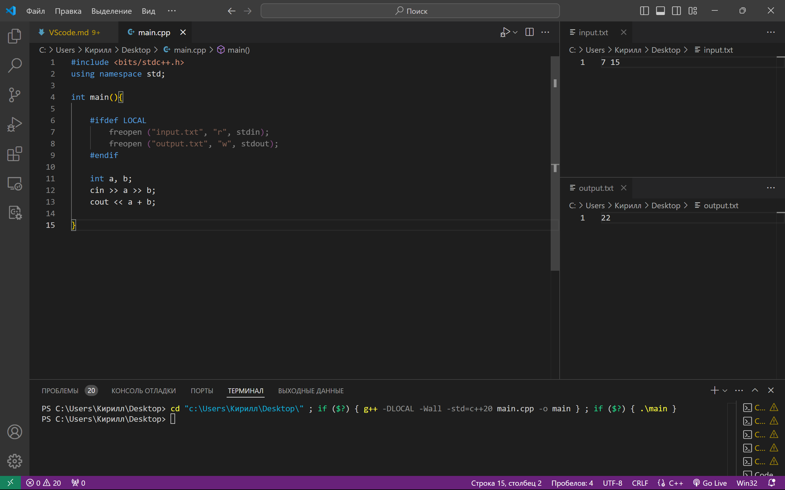
