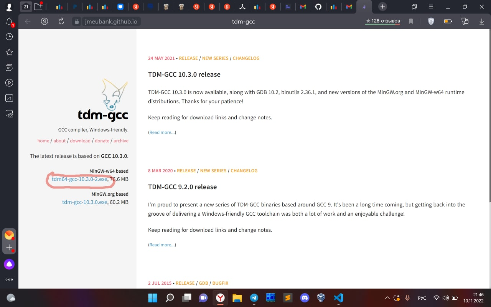
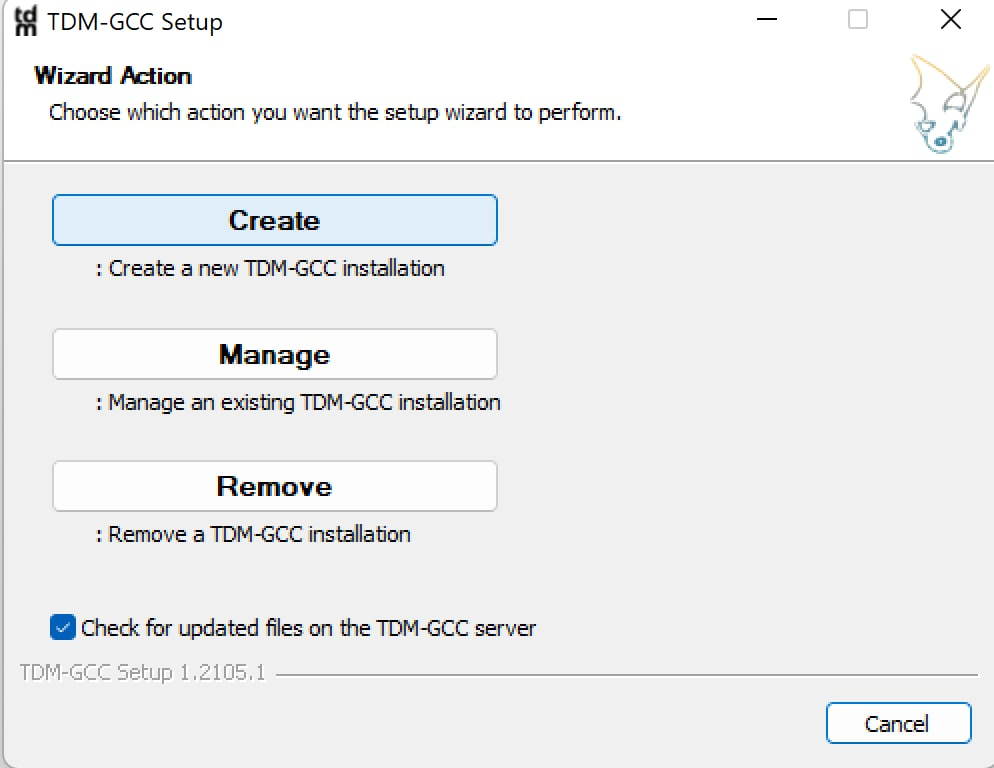
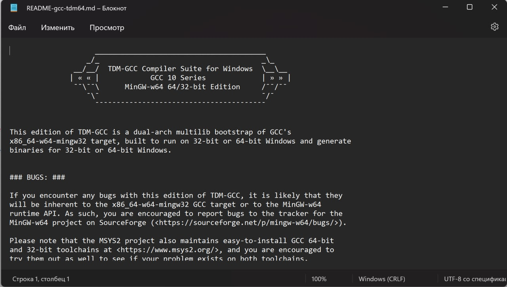

1.  Скачать компилятор

    https://jmeubank.github.io/tdm-gcc/
    
    

2.  Запустим установщик. 

    Жмем "Create", дальше со всем соглашаемся, и завершаем установку

    

3.  После установки может открыться такой текстовый файл. просто закройте.

    

4.  Компилятор установлен. 

    Рекомендую перейти к [установке VS code](https://github.com/kolychestiy/olymp/blob/main/Настройка%20компьютера/настройка%20VS%20code.md)
